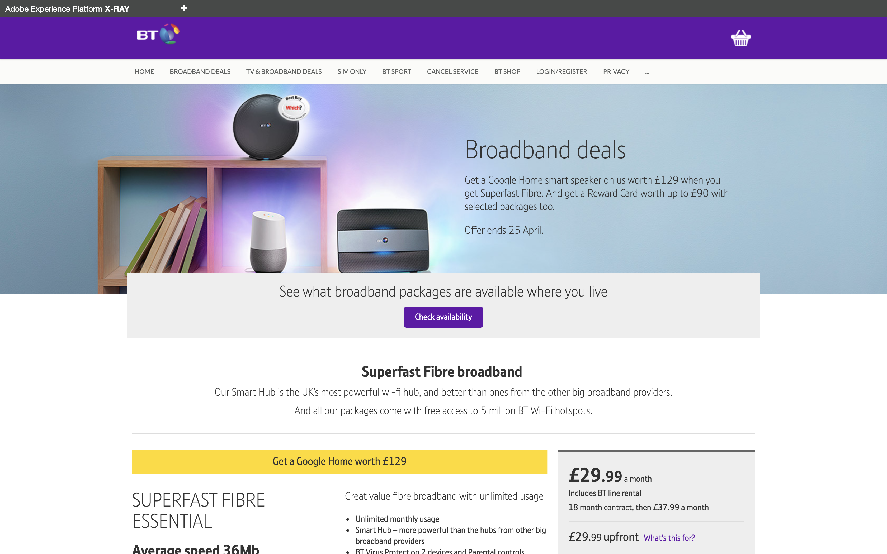

## Exercise 0 - Explore the Luma website

In this exercise, you'll explore the Luma website that is installed on your local machine.

This site is currently tagged with a default Launch property and already sends data to Adobe Experience Platform.

In this module, we'll have a look at what is required to capture profile information and customer behavior from this website and stream it to Adobe Experience Platform.

The URL to access the Luma website is [http://localhost:8888](http://localhost:8888).
 Luma
### Exercise 0.1 - Explore Luma website

Go to to [http://localhost:8888](http://localhost:8888).

In the site's menu, click on Broadband Deals to visit that page.

In the site's menu, click on Sports to visit that page.

Go to the Login/Register page and fill out your own details to register. Click "Create Account" to create your account.

Now that you've seen the website a first time, let's dig into the setup!

---

[Next Step: Exercise 1 - Configure Schemas and Set Identifiers](./ex1.md)