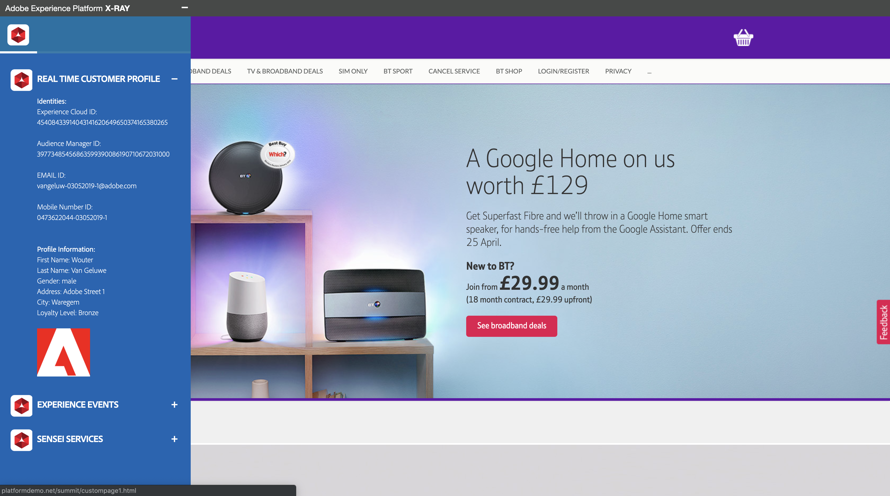

## Exercise 1 - Visit the Luma website

In this exercise, you'll follow a script and walk through the Luma website on your local machine.

The URL to access the Luma website is: [http://localhost:8888](http://localhost:8888)
 
### Story
In this exercise, the goal is to have you walk through the Luma customer journey and act like a real customer.

You can access the demo website by going to [http://localhost:8888](http://localhost:8888)

On this website, we've implemented Adobe Experience Platform. Every activity is considered an Experience Event and is sent like that to Adobe Experience Platform in real-time, and hydrates the Real-Time Customer Profile.

In this journey, you'll start as an anonymous customer who browses the Luma website and after a couple of steps, you'll become a known customer which will fuel Adobe Experience Platform's Real-Time Customer Profile.

### Exercise 1.1 - Visit the Luma website

Let's start.

Go to to [http://localhost:8888](http://localhost:8888).

You'll be redirected to the Admin homepage.

 

Click on ``Select Brand``

 

Selct the brand ``Luma Telco``out of the dropdown-list and click ``Save``.

 

Wait 10 seconds twhile the brand is loading.

 

Once the brand is loaded, you'll be redirected to the homepage of Luma Telco.

In the site's menu, click on Broadband Deals to visit that page.

In the site's menu, click on TV & Broadband Deals to visit that page.

In the site's menu, click on Mobile to visit that page.

In the site's menu, click on Sports to visit that page.

After visiting the Luma Sport page, go to the Login/Register page and fill out your own details to register. Click "Create Account" to create your account.

Go back to the Homepage of the Luma website and open the Adobe Experience Platform X-ray panel. The X-ray panel is a live and dynamic panel that updates in real-time and shows the kind of information that is available in Adobe Experience Platform.

By opening the Real-Time Customer Profile panel, you should see something similar to the below, showing the different identities that are part of your profile, together with the declared personal information that you filled out on the registration form.

By opening the Experience Events panel, you should be seeing an entry for each page you've visited. Please note that Adobe Experience Platform captures and stores all data by linking it to an ID, regardless of whether the customer was anonymous or known. You'll notice that all your page views are shown here, also for the pages that were visited while you were still unknown.

By opening the Sensei Services panel, you should be seeing an Churn Score of 0.00. Since you've just created your Account with Luma, you don't have any products yet and as such, aren't at risk of churning yet.

On the homepage, scroll down and click on the product "Samsung Galaxy S9".

On the Samsung Galaxy S9 product detail page, click the "Add To Cart"-button twice to add 2 products to your cart. You should see the amount of products being updated on the shopping basket in the upper right corner of your screen. 

Click on the shopping basket icon to start the checkout process.

On the Cart page, select your payment method and delivery type. Click Purchase to finalize the purchase.

On the purchase confirmation page, you'll see your order confirmation.

Open the X-ray panel again, to see the updated Experience Events, where you should see additional Browse Activity and also, the products that you added to your basket.

With this information on the X-ray panel, let's now have a look inside Adobe Experience Platform.

---

[Next Step: Exercise 2 - Visualize your own real-time customer profile](./ex2.md)