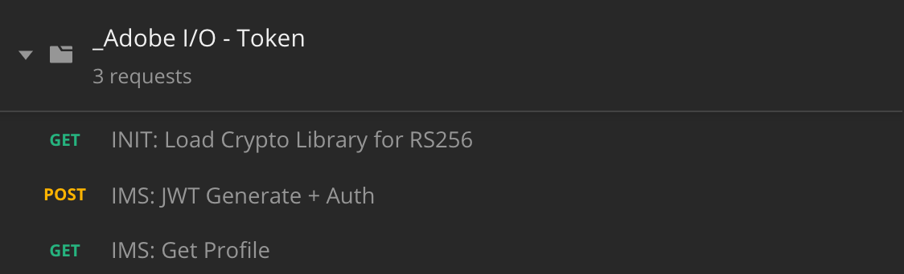

## Exercise 3 - Visualize your own real-time customer profile - API

In this exercise, you'll use Postman and Adobe I/O to query Adobe Expeience Platform's API's to view your own real-time customer profile.
 
### Story

In the real-time customer profile, all profile data is shown alongside behavioral and transactional data and the view will also be enriched with existing segment memberships. The data that is shown here comes from anywhere, from any Adobe Solution to any external solution. This is the most powerful view of Adobe Experience Platform: the true Experience System of Record.
The Real-Time Customer Profile can be consumed by all Adobe solutions, but also by external solutions like Call Centers or in-store clienteling apps. The way to do is is to connect those external solutions to Adobe Experience Platform's API's.

#### Exercise 3.1 - Your Identifiers

On the X-ray panel on your local Luma website, you can find multiple identities. Every Identity is linked to a Namespace. 


On the X-ray panel, we can see 4 different combinations of ID's and Namespaces:

| Identity     | Namespace       |
|:-------------:| :---------------:|
| Experience Cloud ID (ECID)          | 90014021956975674902237594792029773083 |
| Audience Manager ID          | 89715142325500824041562588466774465278 |
| Email ID          | vangeluw-16042019-10@adobe.com |
| Mobile Number ID          | 0473622044-16042019-10 |

Remember these identifiers for the next exercise.

With these ID's in mind, go to Postman.

#### Exercise 3.2 - Postman authentication to Adobe I/O

On your machine, look at the taskbar and open ```Postman```.


Before sending any request to Platform, you need to be properly authenticated. To be authenticated, you need to request an access token.

Make sure that you've got the right Environment selected before executing any call. You can check the currently selected Environment by verifying the Environment-dropdown list in the top right corner. 

The selected Environment should be ```_SPP Partner Enablement - JWT```.


You need to load an external library that will take care of the encryption and decryption of communication. To load this library, you have to execute the call with the name ```INIT: Load Crypto Library for RS256```. Select this call in the ```_Adobe I/O - Token collection``` and you'll see it displayed in the middle of your screen.




Click the blue "Send"-button. After a couple of seconds, you should see a response displayed in the "Body" section of Postman:


With the crypto libray now loaded, we can authenticate to Adobe I/O.
In the \_Adobe I/O - Token collection, select the call with the name ```IMS: JWT Generate + Auth```. Again, you'll see the call details displayed in the middle of the screen.


Click the blue "Send"-button. After a couple of seconds, you should see a response displayed in the "Body" section of Postman:


If your configuration was successfull, you should see a similar response that contains the following information:

| Key     | Value     | 
|:-------------:| :---------------:| 
| token_type          | **bearer** |
| access_token    | **eyJ4NXUiOiJpbXNfbmEx...QT7mqZkumN1tdsPEioOEl4087Dg** | 
| expires_in          | **86399973** |

Adobe I/O has given us a 'bearer'-token, with a specific value (this very long access_token) and an expiration window.

The token that we've received is now valid for 24 hours. This means that after 24 hours, if you want to use Postman to authenticate to Adobe I/O, you will have to generate a new token by running this call again.

#### Exercise 3.3 - Real-Time Customer Profile API, Schema: Profile

Now you can go ahead and send your first call to Platform's Unified Profile Service API's.

In Postman, locate the collection ```_Summit Tech Labs - JWT```.


In "1. Unified Profile Service", select the first call with the name "UPS - GET Profile by Entity ID & NS".


For this call, there are 3 required variables:

| Key     | Value     | 
|:-------------:| :---------------:| 
| entityId          | **id** |
| entityIdNS    | **namespace** | 
| schema.name          | **\_xdm.context.profile** |

* entityId = the specific customer ID
* entityIdNS = the specific namespace that is applicable to the ID
* schema.name = the specific schema for which you want to receive information

So, if you want to ask Platform's API's to give you back all Profile information for your own ecid, you will need to configure the call as follows:

| Key     | Value     | 
|:-------------:| :---------------:| 
| entityId          | **yourECID** |
| entityIdNS    | **ecid** | 
| schema.name          | **\_xdm.context.profile** |


Click "Send" to send your request to Platform.

You should get an immediate response from Platform, showing you something like this:


This is the full response from Platform:

```
{
    "A28Ch_kCm2frfBvdMqqbiA0f": {
        "entityId": "A28Ch_kCm2frfBvdMqqbiA0f",
        "mergePolicy": {
            "id": "6e47c858-1b5e-45c9-ad02-fa38eee381f8"
        },
        "sources": [
            "",
            "5caecececebc5914b2019607"
        ],
        "tags": [
            "",
            "1555439802481:0575:6"
        ],
        "identityGraph": [
            "A28Ch_kCm2frfBvdMqqbiA0f",
            "BUF5dmFuZ2VsdXctgiPI9C0xMEBhZG9iZS5jb20",
            "BkFskxyw1VctgiPI9C0xMA"
        ],
        "entity": {
            "personalEmail": {
                "address": "vangeluw-16042019-10@adobe.com"
            },
            "_repo": {
                "createDate": "2019-04-16T20:36:42Z"
            },
            "homeAddress": {
                "country": "Belgium",
                "city": "Brussels",
                "postalCode": "1000",
                "street1": "Street"
            },
            "mobilePhone": {
                "number": "0473622044-16042019-10"
            },
            "_platformlab05": {
                "identification": {
                    "ecid": "90014021956975674902237594792029773083",
                    "emailId": "vangeluw-16042019-10@adobe.com",
                    "mobilenr": "0473622044-16042019-10"
                },
                "churnInformation": {
                    "churnScore": "0.00"
                },
                "loyaltyInformation": {
                    "loyaltyLevel": "Bronze"
                }
            },
            "person": {
                "gender": "male",
                "name": {
                    "lastName": "Van Geluwe",
                    "firstName": "Wouter"
                }
            },
            "profilePictureLink": "http://s7e4a.scene7.com/is/image/OmniPS/adobelogo?$fmt=alpha-png",
            "identityMap": {
                "ecid": [
                    {
                        "id": "90014021956975674902237594792029773083"
                    }
                ],
                "email": [
                    {
                        "id": "vangeluw-16042019-10@adobe.com"
                    }
                ],
                "phone": [
                    {
                        "id": "0473622044-16042019-10"
                    }
                ]
            }
        },
        "lastModifiedAt": "2019-04-16T18:36:42Z"
    }
}
```
This is currently all of the available Profile data in Platform for this ECID.
You're not required to use the ECID to request Profile data from Platform's Unified Profile, you can use any ID in any namespace to request this data. 

Let's go back to Postman and pretend we're the call center, and send a call to Platform specifying the namespace of **Phone** and your mobile number.

So, if you want to ask Platform's API's to give you back all Profile information for a specific Phone, you will need to configure the call as follows:

| Key     | Value     | 
|:-------------:| :---------------:| 
| entityId          | **your phone nr** |
| entityIdNS    | **Phone** \(replace ecid with Phone) | 
| schema.name          | **\_xdm.context.profile** |


Click the blue "Send"-button and verify the response.


Let's do the same thing for your email ID by specifying the namespace of **email** and your email ID.

So, if you want to ask Platform's API's to give you back all Profile information for a specific email ID, you will need to configure the call as follows:

| Key     | Value     | 
|:-------------:| :---------------:| 
| entityId          | **youremail** |
| entityIdNS    | **email** \(replace Phone with email) | 
| schema.name          | **\_xdm.context.profile** |


Click the blue "Send"-button and verify the response.


This is a very important kind of flexibility that is offered to brands. This means that any environment can send a request to Platform, using their own ID and namespace, without having to understand the complexity of multiple namespaces and ID's.

As an example:

  * the Call Center will request data from Platform using the namespace "Phone"
  * the Loyalty System will request data from Platform using the namespace "email"
  * online applications might use the namespace "ecid"

The Call Center doesn't necessarily know what kind of identifier is used in the Loyalty System and the Loyalty System doesn't necessarily know what kind of identifier is used by online applications. Each individual system can use the information that they have and understand to get the information they need, when they need it.

#### Exercise 3.4 - Real-Time Customer Profile API, Schema: Profile and ExperienceEvent

After having queried Platform's API's successfully for Profile data, let's now do the same with ExperienceEvent data.

In Postman, locate the collection ```_Summit Tech Labs - JWT```.


In "1. Unified Profile Service", select the second call with the name "UPS - GET Profile & EE by Entity ID & NS".


For this call, there are 4 required variables:

| Key     | Value     | 
|:-------------:| :---------------:| 
| schema.name          | **\_xdm.context.experienceevent** |
| relatedSchema.name          | **\_xdm.context.profile** |
| relatedEntityId          | **id** |
| relatedEntityIdNS    | **namespace** | 

* schema.name = the specific schema for which you want to receive information. In this case, we're looking for data that is mapped against the ExperienceEvent schema. 
* relatedSchema.name = While we're looking for data that is mapped against the ExperienceEvent schema, we need to specify an identity for which we want to receive that data. The schema that has access to identity is the Profile-schema, so the relatedSchema here is the Profile-schema.
* relatedEntityId = the specific customer ID
* relatedEntityIdNS = the specific namespace that is applicable to the ID


So, if you want to ask Platform's API's to give you back all Profile information for your own ecid, you will need to configure the call as follows:

| Key     | Value     | 
|:-------------:| :---------------:| 
| schema.name          | **\_xdm.context.experienceevent** |
| relatedSchema.name          | **\_xdm.context.profile** |
| relatedEntityId          | **yourECID** |
| relatedEntityIdNS    | **ecid** | 


Click "Send" to send your request to Platform.

You should get an immediate response from Platform, showing you something like this:


Below is the full response from Platform. In this example, there are 8 ExperienceEvents linked to this customer's ECID. Have a look at the below to see the different variables on the call, as what you see below is the direct consequence of your configuration in Launch in previous exercises.

Also, when the X-ray panel shows ExperienceEvent information, it is using the below payload to parse and retrieve the information like Product Name (search for productName in the below payload) and Product Image URL (search for productImageUrl in the below payload).

```
{
    "_page": {
        "orderby": "timestamp",
        "start": "4276706570715.485",
        "count": 21,
        "next": ""
    },
    "children": [
        {
            "relatedEntityId": "A28Ch_kCm2frfBvdMqqbiA0f",
            "entityId": "4276706570715.485",
            "timestamp": 1555446719000,
            "entity": {
                "environment": {
                    "browserDetails": {
                        "acceptLanguage": "en",
                        "userAgent": "Mozilla/5.0 (Macintosh; Intel Mac OS X 10_14_4) AppleWebKit/537.36 (KHTML, like Gecko) Chrome/73.0.3683.103 Safari/537.36"
                    }
                },
                "web": {
                    "webPageDetails": {
                        "name": "Broadband Deals"
                    }
                },
                "identityMap": {
                    "ECID": [
                        {
                            "id": "90014021956975674902237594792029773083",
                            "primary": true
                        }
                    ]
                },
                "_id": "4276706570715.485",
                "productListItems": [
                    {
                        "SKU": "Broadband Deals"
                    }
                ],
                "_platformlab05": {
                    "identification": {
                        "ecid": "90014021956975674902237594792029773083"
                    },
                    "productData": {
                        "productImageUrl": "http://s7e4a.scene7.com/is/image/OmniPS/Lumaee?fmt=png-alpha",
                        "productInteraction": "productView",
                        "productName": "Broadband Deals"
                    }
                },
                "timestamp": "2019-04-16T20:31:59Z"
            },
            "lastModifiedAt": "2019-04-16T18:32:00Z"
        },
        {
            "relatedEntityId": "A28Ch_kCm2frfBvdMqqbiA0f",
            "entityId": "1785023472094.1506",
            "timestamp": 1555446725000,
            "entity": {
                "environment": {
                    "browserDetails": {
                        "acceptLanguage": "en",
                        "userAgent": "Mozilla/5.0 (Macintosh; Intel Mac OS X 10_14_4) AppleWebKit/537.36 (KHTML, like Gecko) Chrome/73.0.3683.103 Safari/537.36"
                    }
                },
                "web": {
                    "webPageDetails": {
                        "name": "TV & Broadband Deals"
                    }
                },
                "identityMap": {
                    "ECID": [
                        {
                            "id": "90014021956975674902237594792029773083",
                            "primary": true
                        }
                    ]
                },
                "_id": "1785023472094.1506",
                "productListItems": [
                    {
                        "SKU": "TV & Broadband Deals"
                    }
                ],
                "_platformlab05": {
                    "identification": {
                        "ecid": "90014021956975674902237594792029773083"
                    },
                    "productData": {
                        "productImageUrl": "http://s7e4a.scene7.com/is/image/OmniPS/Lumaee?fmt=png-alpha",
                        "productInteraction": "productView",
                        "productName": "TV & Broadband Deals"
                    }
                },
                "timestamp": "2019-04-16T20:32:05Z"
            },
            "lastModifiedAt": "2019-04-16T18:32:05Z"
        },
        {
            "relatedEntityId": "A28Ch_kCm2frfBvdMqqbiA0f",
            "entityId": "2085997802875.4734",
            "timestamp": 1555446732000,
            "entity": {
                "environment": {
                    "browserDetails": {
                        "acceptLanguage": "en",
                        "userAgent": "Mozilla/5.0 (Macintosh; Intel Mac OS X 10_14_4) AppleWebKit/537.36 (KHTML, like Gecko) Chrome/73.0.3683.103 Safari/537.36"
                    }
                },
                "web": {
                    "webPageDetails": {
                        "name": "SIM Only"
                    }
                },
                "identityMap": {
                    "ECID": [
                        {
                            "id": "90014021956975674902237594792029773083",
                            "primary": true
                        }
                    ]
                },
                "_id": "2085997802875.4734",
                "productListItems": [
                    {
                        "SKU": "SIM Only"
                    }
                ],
                "_platformlab05": {
                    "identification": {
                        "ecid": "90014021956975674902237594792029773083"
                    },
                    "productData": {
                        "productImageUrl": "http://s7e4a.scene7.com/is/image/OmniPS/Lumaee?fmt=png-alpha",
                        "productInteraction": "productView",
                        "productName": "SIM Only"
                    }
                },
                "timestamp": "2019-04-16T20:32:12Z"
            },
            "lastModifiedAt": "2019-04-16T18:32:13Z"
        },
        {
            "relatedEntityId": "A28Ch_kCm2frfBvdMqqbiA0f",
            "entityId": "1552565832270.8938",
            "timestamp": 1555446737000,
            "entity": {
                "environment": {
                    "browserDetails": {
                        "acceptLanguage": "en",
                        "userAgent": "Mozilla/5.0 (Macintosh; Intel Mac OS X 10_14_4) AppleWebKit/537.36 (KHTML, like Gecko) Chrome/73.0.3683.103 Safari/537.36"
                    }
                },
                "web": {
                    "webPageDetails": {
                        "name": "Luma Sport"
                    }
                },
                "identityMap": {
                    "ECID": [
                        {
                            "id": "90014021956975674902237594792029773083",
                            "primary": true
                        }
                    ]
                },
                "_id": "1552565832270.8938",
                "productListItems": [
                    {
                        "SKU": "Luma Sport"
                    }
                ],
                "_platformlab05": {
                    "identification": {
                        "ecid": "90014021956975674902237594792029773083"
                    },
                    "productData": {
                        "productImageUrl": "http://s7e4a.scene7.com/is/image/OmniPS/Lumaee?fmt=png-alpha",
                        "productInteraction": "productView",
                        "productName": "Luma Sport"
                    }
                },
                "timestamp": "2019-04-16T20:32:17Z"
            },
            "lastModifiedAt": "2019-04-16T18:32:18Z"
        },
        {
            "relatedEntityId": "A28Ch_kCm2frfBvdMqqbiA0f",
            "entityId": "8531387114785.904",
            "timestamp": 1555446749000,
            "entity": {
                "environment": {
                    "browserDetails": {
                        "acceptLanguage": "en",
                        "userAgent": "Mozilla/5.0 (Macintosh; Intel Mac OS X 10_14_4) AppleWebKit/537.36 (KHTML, like Gecko) Chrome/73.0.3683.103 Safari/537.36"
                    }
                },
                "web": {
                    "webPageDetails": {
                        "name": "Register"
                    }
                },
                "identityMap": {
                    "ECID": [
                        {
                            "id": "90014021956975674902237594792029773083",
                            "primary": true
                        }
                    ]
                },
                "_id": "8531387114785.904",
                "_platformlab05": {
                    "identification": {
                        "ecid": "90014021956975674902237594792029773083"
                    }
                },
                "timestamp": "2019-04-16T20:32:29Z"
            },
            "lastModifiedAt": "2019-04-16T18:32:30Z"
        },
        {
            "relatedEntityId": "A28Ch_kCm2frfBvdMqqbiA0f",
            "entityId": "6904885448195.17",
            "timestamp": 1555446797000,
            "entity": {
                "environment": {
                    "browserDetails": {
                        "acceptLanguage": "en",
                        "userAgent": "Mozilla/5.0 (Macintosh; Intel Mac OS X 10_14_4) AppleWebKit/537.36 (KHTML, like Gecko) Chrome/73.0.3683.103 Safari/537.36"
                    }
                },
                "web": {
                    "webPageDetails": {
                        "name": "Luma Home"
                    }
                },
                "identityMap": {
                    "ECID": [
                        {
                            "id": "90014021956975674902237594792029773083",
                            "primary": true
                        }
                    ]
                },
                "_id": "6904885448195.17",
                "_platformlab05": {
                    "identification": {
                        "ecid": "90014021956975674902237594792029773083"
                    }
                },
                "timestamp": "2019-04-16T20:33:17Z"
            },
            "lastModifiedAt": "2019-04-16T18:33:18Z"
        },
        {
            "relatedEntityId": "A28Ch_kCm2frfBvdMqqbiA0f",
            "entityId": "8256898201653.82",
            "timestamp": 1555446806000,
            "entity": {
                "environment": {
                    "browserDetails": {
                        "acceptLanguage": "en",
                        "userAgent": "Mozilla/5.0 (Macintosh; Intel Mac OS X 10_14_4) AppleWebKit/537.36 (KHTML, like Gecko) Chrome/73.0.3683.103 Safari/537.36"
                    }
                },
                "web": {
                    "webPageDetails": {
                        "name": "Luma Home"
                    }
                },
                "identityMap": {
                    "ECID": [
                        {
                            "id": "90014021956975674902237594792029773083",
                            "primary": true
                        }
                    ]
                },
                "_id": "8256898201653.82",
                "_platformlab05": {
                    "identification": {
                        "ecid": "90014021956975674902237594792029773083"
                    }
                },
                "timestamp": "2019-04-16T20:33:26Z"
            },
            "lastModifiedAt": "2019-04-16T18:33:27Z"
        },
        {
            "relatedEntityId": "A28Ch_kCm2frfBvdMqqbiA0f",
            "entityId": "1946760732612.2976",
            "timestamp": 1555446811000,
            "entity": {
                "environment": {
                    "browserDetails": {
                        "acceptLanguage": "en",
                        "userAgent": "Mozilla/5.0 (Macintosh; Intel Mac OS X 10_14_4) AppleWebKit/537.36 (KHTML, like Gecko) Chrome/73.0.3683.103 Safari/537.36"
                    }
                },
                "web": {
                    "webPageDetails": {
                        "name": "Luma Home"
                    }
                },
                "identityMap": {
                    "ECID": [
                        {
                            "id": "90014021956975674902237594792029773083",
                            "primary": true
                        }
                    ]
                },
                "_id": "1946760732612.2976",
                "_platformlab05": {
                    "identification": {
                        "ecid": "90014021956975674902237594792029773083"
                    }
                },
                "timestamp": "2019-04-16T20:33:31Z"
            },
            "lastModifiedAt": "2019-04-16T18:33:31Z"
        },
        {
            "relatedEntityId": "A28Ch_kCm2frfBvdMqqbiA0f",
            "entityId": "4585312183400.069",
            "timestamp": 1555446821000,
            "entity": {
                "environment": {
                    "browserDetails": {
                        "acceptLanguage": "en",
                        "userAgent": "Mozilla/5.0 (Macintosh; Intel Mac OS X 10_14_4) AppleWebKit/537.36 (KHTML, like Gecko) Chrome/73.0.3683.103 Safari/537.36"
                    }
                },
                "web": {
                    "webPageDetails": {
                        "name": "Luma Home"
                    }
                },
                "identityMap": {
                    "ECID": [
                        {
                            "id": "90014021956975674902237594792029773083",
                            "primary": true
                        }
                    ]
                },
                "_id": "4585312183400.069",
                "_platformlab05": {
                    "identification": {
                        "ecid": "90014021956975674902237594792029773083"
                    }
                },
                "timestamp": "2019-04-16T20:33:41Z"
            },
            "lastModifiedAt": "2019-04-16T18:33:41Z"
        },
        {
            "relatedEntityId": "A28Ch_kCm2frfBvdMqqbiA0f",
            "entityId": "2593578684590.12",
            "timestamp": 1555446843000,
            "entity": {
                "environment": {
                    "browserDetails": {
                        "acceptLanguage": "en",
                        "userAgent": "Mozilla/5.0 (Macintosh; Intel Mac OS X 10_14_4) AppleWebKit/537.36 (KHTML, like Gecko) Chrome/73.0.3683.103 Safari/537.36"
                    }
                },
                "web": {
                    "webPageDetails": {
                        "name": "Luma Home"
                    }
                },
                "identityMap": {
                    "ECID": [
                        {
                            "id": "90014021956975674902237594792029773083",
                            "primary": true
                        }
                    ]
                },
                "_id": "2593578684590.12",
                "_platformlab05": {
                    "identification": {
                        "ecid": "90014021956975674902237594792029773083"
                    }
                },
                "timestamp": "2019-04-16T20:34:03Z"
            },
            "lastModifiedAt": "2019-04-16T18:34:03Z"
        },
        {
            "relatedEntityId": "A28Ch_kCm2frfBvdMqqbiA0f",
            "entityId": "1154016615532.2478",
            "timestamp": 1555446882000,
            "entity": {
                "environment": {
                    "browserDetails": {
                        "acceptLanguage": "en",
                        "userAgent": "Mozilla/5.0 (Macintosh; Intel Mac OS X 10_14_4) AppleWebKit/537.36 (KHTML, like Gecko) Chrome/73.0.3683.103 Safari/537.36"
                    }
                },
                "web": {
                    "webPageDetails": {
                        "name": "Register"
                    }
                },
                "identityMap": {
                    "ECID": [
                        {
                            "id": "90014021956975674902237594792029773083",
                            "primary": true
                        }
                    ]
                },
                "_id": "1154016615532.2478",
                "_platformlab05": {
                    "identification": {
                        "ecid": "90014021956975674902237594792029773083"
                    }
                },
                "timestamp": "2019-04-16T20:34:42Z"
            },
            "lastModifiedAt": "2019-04-16T18:34:43Z"
        },
        {
            "relatedEntityId": "A28Ch_kCm2frfBvdMqqbiA0f",
            "entityId": "3342523712840.034",
            "timestamp": 1555446904000,
            "entity": {
                "environment": {
                    "browserDetails": {
                        "acceptLanguage": "en",
                        "userAgent": "Mozilla/5.0 (Macintosh; Intel Mac OS X 10_14_4) AppleWebKit/537.36 (KHTML, like Gecko) Chrome/73.0.3683.103 Safari/537.36"
                    }
                },
                "web": {
                    "webPageDetails": {
                        "name": "Register"
                    }
                },
                "identityMap": {
                    "ECID": [
                        {
                            "id": "90014021956975674902237594792029773083",
                            "primary": true
                        }
                    ]
                },
                "_id": "3342523712840.034",
                "_platformlab05": {
                    "identification": {
                        "ecid": "90014021956975674902237594792029773083"
                    }
                },
                "timestamp": "2019-04-16T20:35:04Z"
            },
            "lastModifiedAt": "2019-04-16T18:35:04Z"
        },
        {
            "relatedEntityId": "A28Ch_kCm2frfBvdMqqbiA0f",
            "entityId": "2064967307138.0408",
            "timestamp": 1555446909000,
            "entity": {
                "environment": {
                    "browserDetails": {
                        "acceptLanguage": "en",
                        "userAgent": "Mozilla/5.0 (Macintosh; Intel Mac OS X 10_14_4) AppleWebKit/537.36 (KHTML, like Gecko) Chrome/73.0.3683.103 Safari/537.36"
                    }
                },
                "web": {
                    "webPageDetails": {
                        "name": "Luma Home"
                    }
                },
                "identityMap": {
                    "ECID": [
                        {
                            "id": "90014021956975674902237594792029773083",
                            "primary": true
                        }
                    ]
                },
                "_id": "2064967307138.0408",
                "_platformlab05": {
                    "identification": {
                        "ecid": "90014021956975674902237594792029773083"
                    }
                },
                "timestamp": "2019-04-16T20:35:09Z"
            },
            "lastModifiedAt": "2019-04-16T18:35:10Z"
        },
        {
            "relatedEntityId": "A28Ch_kCm2frfBvdMqqbiA0f",
            "entityId": "8546656854971.625",
            "timestamp": 1555446967000,
            "entity": {
                "environment": {
                    "browserDetails": {
                        "acceptLanguage": "en",
                        "userAgent": "Mozilla/5.0 (Macintosh; Intel Mac OS X 10_14_4) AppleWebKit/537.36 (KHTML, like Gecko) Chrome/73.0.3683.103 Safari/537.36"
                    }
                },
                "web": {
                    "webPageDetails": {
                        "name": "Luma Shop"
                    }
                },
                "identityMap": {
                    "ECID": [
                        {
                            "id": "90014021956975674902237594792029773083",
                            "primary": true
                        }
                    ]
                },
                "_id": "8546656854971.625",
                "productListItems": [
                    {
                        "SKU": "Luma Shop"
                    }
                ],
                "_platformlab05": {
                    "identification": {
                        "ecid": "90014021956975674902237594792029773083"
                    },
                    "productData": {
                        "productImageUrl": "http://s7e4a.scene7.com/is/image/OmniPS/Lumaee?fmt=png-alpha",
                        "productInteraction": "productView",
                        "productName": "Luma Shop"
                    }
                },
                "timestamp": "2019-04-16T20:36:07Z"
            },
            "lastModifiedAt": "2019-04-16T18:36:08Z"
        },
        {
            "relatedEntityId": "A28Ch_kCm2frfBvdMqqbiA0f",
            "entityId": "2247900697381.276",
            "timestamp": 1555446974000,
            "entity": {
                "environment": {
                    "browserDetails": {
                        "acceptLanguage": "en",
                        "userAgent": "Mozilla/5.0 (Macintosh; Intel Mac OS X 10_14_4) AppleWebKit/537.36 (KHTML, like Gecko) Chrome/73.0.3683.103 Safari/537.36"
                    }
                },
                "web": {
                    "webPageDetails": {
                        "name": "Samsung Galaxy S8"
                    }
                },
                "identityMap": {
                    "ECID": [
                        {
                            "id": "90014021956975674902237594792029773083",
                            "primary": true
                        }
                    ]
                },
                "_id": "2247900697381.276",
                "productListItems": [
                    {
                        "SKU": "Samsung Galaxy S8"
                    }
                ],
                "_platformlab05": {
                    "identification": {
                        "ecid": "90014021956975674902237594792029773083"
                    },
                    "productData": {
                        "productImageUrl": "http://s7e4a.scene7.com/is/image/OmniPS/s8-1?fmt=png-alpha",
                        "productInteraction": "productView",
                        "productName": "Samsung Galaxy S8"
                    }
                },
                "timestamp": "2019-04-16T20:36:14Z"
            },
            "lastModifiedAt": "2019-04-16T18:36:15Z"
        },
        {
            "relatedEntityId": "A28Ch_kCm2frfBvdMqqbiA0f",
            "entityId": "5356344049662.133",
            "timestamp": 1555446978000,
            "entity": {
                "environment": {
                    "browserDetails": {
                        "acceptLanguage": "en",
                        "userAgent": "Mozilla/5.0 (Macintosh; Intel Mac OS X 10_14_4) AppleWebKit/537.36 (KHTML, like Gecko) Chrome/73.0.3683.103 Safari/537.36"
                    }
                },
                "web": {
                    "webPageDetails": {
                        "name": "Samsung Galaxy S8",
                        "URL": "http://platformdemo.net/summit/p1.html"
                    }
                },
                "identityMap": {
                    "ECID": [
                        {
                            "id": "90014021956975674902237594792029773083",
                            "primary": true
                        }
                    ]
                },
                "_id": "5356344049662.133",
                "productListItems": [
                    {
                        "SKU": "Samsung Galaxy S8"
                    }
                ],
                "_platformlab05": {
                    "identification": {
                        "ecid": "90014021956975674902237594792029773083"
                    },
                    "productData": {
                        "productImageUrl": "http://s7e4a.scene7.com/is/image/OmniPS/s8-1?fmt=png-alpha",
                        "productInteraction": "productAddToCart",
                        "productName": "Samsung Galaxy S8"
                    }
                },
                "timestamp": "2019-04-16T20:36:18Z"
            },
            "lastModifiedAt": "2019-04-16T18:36:19Z"
        },
        {
            "relatedEntityId": "A28Ch_kCm2frfBvdMqqbiA0f",
            "entityId": "7535725126688.831",
            "timestamp": 1555446979000,
            "entity": {
                "environment": {
                    "browserDetails": {
                        "acceptLanguage": "en",
                        "userAgent": "Mozilla/5.0 (Macintosh; Intel Mac OS X 10_14_4) AppleWebKit/537.36 (KHTML, like Gecko) Chrome/73.0.3683.103 Safari/537.36"
                    }
                },
                "web": {
                    "webPageDetails": {
                        "name": "Samsung Galaxy S8",
                        "URL": "http://platformdemo.net/summit/p1.html"
                    }
                },
                "identityMap": {
                    "ECID": [
                        {
                            "id": "90014021956975674902237594792029773083",
                            "primary": true
                        }
                    ]
                },
                "_id": "7535725126688.831",
                "productListItems": [
                    {
                        "SKU": "Samsung Galaxy S8"
                    }
                ],
                "_platformlab05": {
                    "identification": {
                        "ecid": "90014021956975674902237594792029773083"
                    },
                    "productData": {
                        "productImageUrl": "http://s7e4a.scene7.com/is/image/OmniPS/s8-1?fmt=png-alpha",
                        "productInteraction": "productAddToCart",
                        "productName": "Samsung Galaxy S8"
                    }
                },
                "timestamp": "2019-04-16T20:36:19Z"
            },
            "lastModifiedAt": "2019-04-16T18:36:19Z"
        },
        {
            "relatedEntityId": "A28Ch_kCm2frfBvdMqqbiA0f",
            "entityId": "3259138635273.466",
            "timestamp": 1555446985000,
            "entity": {
                "environment": {
                    "browserDetails": {
                        "acceptLanguage": "en",
                        "userAgent": "Mozilla/5.0 (Macintosh; Intel Mac OS X 10_14_4) AppleWebKit/537.36 (KHTML, like Gecko) Chrome/73.0.3683.103 Safari/537.36"
                    }
                },
                "web": {
                    "webPageDetails": {
                        "name": "Luma Shop"
                    }
                },
                "identityMap": {
                    "ECID": [
                        {
                            "id": "90014021956975674902237594792029773083",
                            "primary": true
                        }
                    ]
                },
                "_id": "3259138635273.466",
                "productListItems": [
                    {
                        "SKU": "Luma Shop"
                    }
                ],
                "_platformlab05": {
                    "identification": {
                        "ecid": "90014021956975674902237594792029773083"
                    },
                    "productData": {
                        "productImageUrl": "http://s7e4a.scene7.com/is/image/OmniPS/Lumaee?fmt=png-alpha",
                        "productInteraction": "productView",
                        "productName": "Luma Shop"
                    }
                },
                "timestamp": "2019-04-16T20:36:25Z"
            },
            "lastModifiedAt": "2019-04-16T18:36:25Z"
        },
        {
            "relatedEntityId": "A28Ch_kCm2frfBvdMqqbiA0f",
            "entityId": "5297754240167.107",
            "timestamp": 1555446987000,
            "entity": {
                "environment": {
                    "browserDetails": {
                        "acceptLanguage": "en",
                        "userAgent": "Mozilla/5.0 (Macintosh; Intel Mac OS X 10_14_4) AppleWebKit/537.36 (KHTML, like Gecko) Chrome/73.0.3683.103 Safari/537.36"
                    }
                },
                "web": {
                    "webPageDetails": {
                        "name": "Google Pixel XL 32GB Black Smartphone"
                    }
                },
                "identityMap": {
                    "ECID": [
                        {
                            "id": "90014021956975674902237594792029773083",
                            "primary": true
                        }
                    ]
                },
                "_id": "5297754240167.107",
                "productListItems": [
                    {
                        "SKU": "Google Pixel XL 32GB Black Smartphone"
                    }
                ],
                "_platformlab05": {
                    "identification": {
                        "ecid": "90014021956975674902237594792029773083"
                    },
                    "productData": {
                        "productImageUrl": "http://s7e4a.scene7.com/is/image/OmniPS/pixel1-1?fmt=png-alpha",
                        "productInteraction": "productView",
                        "productName": "Google Pixel XL 32GB Black Smartphone"
                    }
                },
                "timestamp": "2019-04-16T20:36:27Z"
            },
            "lastModifiedAt": "2019-04-16T18:36:27Z"
        },
        {
            "relatedEntityId": "A28Ch_kCm2frfBvdMqqbiA0f",
            "entityId": "580909105394.7396",
            "timestamp": 1555446991000,
            "entity": {
                "environment": {
                    "browserDetails": {
                        "acceptLanguage": "en",
                        "userAgent": "Mozilla/5.0 (Macintosh; Intel Mac OS X 10_14_4) AppleWebKit/537.36 (KHTML, like Gecko) Chrome/73.0.3683.103 Safari/537.36"
                    }
                },
                "web": {
                    "webPageDetails": {
                        "name": "Google Pixel XL 32GB Black Smartphone",
                        "URL": "http://platformdemo.net/summit/p3.html"
                    }
                },
                "identityMap": {
                    "ECID": [
                        {
                            "id": "90014021956975674902237594792029773083",
                            "primary": true
                        }
                    ]
                },
                "_id": "580909105394.7396",
                "productListItems": [
                    {
                        "SKU": "Google Pixel XL 32GB Black Smartphone"
                    }
                ],
                "_platformlab05": {
                    "identification": {
                        "ecid": "90014021956975674902237594792029773083"
                    },
                    "productData": {
                        "productImageUrl": "http://s7e4a.scene7.com/is/image/OmniPS/pixel1-1?fmt=png-alpha",
                        "productInteraction": "productAddToCart",
                        "productName": "Google Pixel XL 32GB Black Smartphone"
                    }
                },
                "timestamp": "2019-04-16T20:36:31Z"
            },
            "lastModifiedAt": "2019-04-16T18:36:31Z"
        },
        {
            "relatedEntityId": "A28Ch_kCm2frfBvdMqqbiA0f",
            "entityId": "9200772822185.55",
            "timestamp": 1555447002000,
            "entity": {
                "environment": {
                    "browserDetails": {
                        "acceptLanguage": "en",
                        "userAgent": "Mozilla/5.0 (Macintosh; Intel Mac OS X 10_14_4) AppleWebKit/537.36 (KHTML, like Gecko) Chrome/73.0.3683.103 Safari/537.36"
                    }
                },
                "web": {
                    "webPageDetails": {
                        "name": "Purchase Confirmation",
                        "URL": "http://platformdemo.net/summit/purchase.html"
                    }
                },
                "identityMap": {
                    "ECID": [
                        {
                            "id": "90014021956975674902237594792029773083",
                            "primary": true
                        }
                    ]
                },
                "_id": "9200772822185.55",
                "commerce": {
                    "order": {
                        "payments": [
                            {
                                "currencyCode": "GBP",
                                "paymentAmount": 2281.99,
                                "transactionID": "480287606",
                                "paymentType": "visa"
                            }
                        ],
                        "priceTotal": 2281.99,
                        "purchaseOrderNumber": "480287606"
                    }
                },
                "productListItems": [
                    {
                        "quantity": 2,
                        "priceTotal": 779,
                        "name": "http://s7e4a.scene7.com/is/image/OmniPS/s8-1?fmt=png-alpha",
                        "SKU": "Samsung Galaxy S8"
                    },
                    {
                        "quantity": 1,
                        "priceTotal": 718.99,
                        "name": "http://s7e4a.scene7.com/is/image/OmniPS/pixel1-1?fmt=png-alpha",
                        "SKU": "Google Pixel XL 32GB Black Smartphone"
                    }
                ],
                "_platformlab05": {
                    "identification": {
                        "ecid": "90014021956975674902237594792029773083"
                    },
                    "productData": {
                        "productInteraction": "productPurchase"
                    }
                },
                "timestamp": "2019-04-16T20:36:42Z"
            },
            "lastModifiedAt": "2019-04-16T18:36:42Z"
        }
    ],
    "_links": {
        "next": {
            "href": ""
        }
    }
}
```

This is currently all of the available ExperienceEvent data in Platform for this ECID.

You're not required to use the ECID to request ExperienceEvent data from Platform's Unified Profile, you can use any ID in any namespace to request this data. 

---

[Next Step: Exercise 4 - Create a segment - UI](./ex4.md)