## Exercise 4 - Create a segment - UI

In this exercise, you'll create a segment by making use of Adobe Experience Platform's new unified segmentation experience.

The URL to login to Adobe Experience Platform is: [https://platform.adobe.com](https://platform.adobe.com)

**Attention!**

Please have a look at your computer's number and memorize it. As part of this exercise you'll need to specify your computer's number when you:

  * Save your segment

 
### Story

In the real-time customer profile, all profile data is shown alongside behavioral and transactional data and the view will also be enriched with existing segment memberships. The data that is shown here comes from anywhere, from any Adobe Solution to any external solution. This is the most powerful view of Adobe Experience Platform: the true Experience System of Record.

To log in to Platform, go to [https://platform.adobe.com/home](https://platform.adobe.com/home). 


In the menu on the left side, go to ```Segments```.

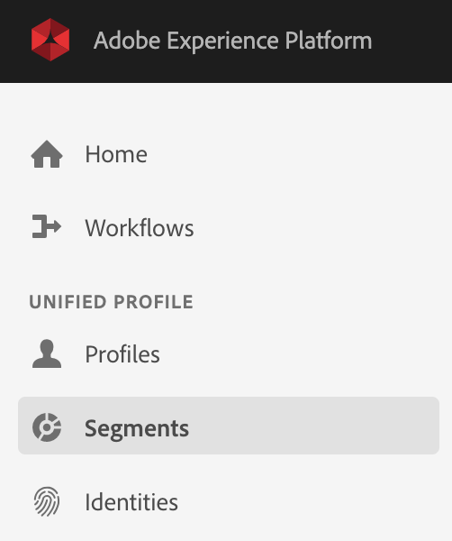

On this page, you can see an overview of all existing segments.


Click on the "Create Segment"-button to start creating a new segment.

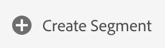

Once you're in the new segment builder, you immediately notice the ```Attributes``` - menu option and the ```Profile```-reference.

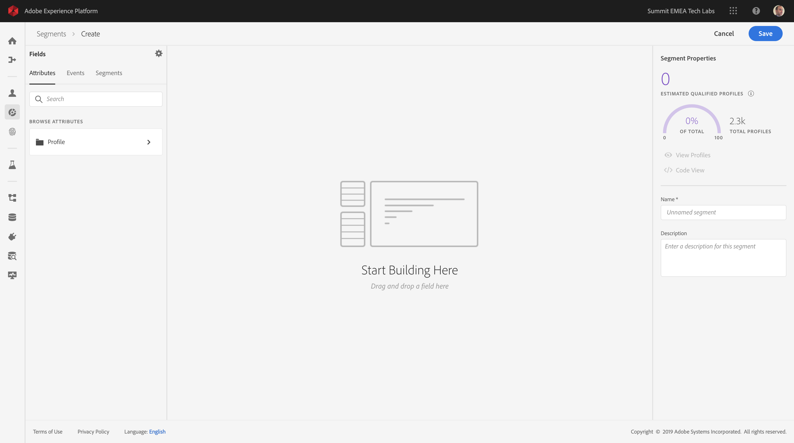

Since XDM is the language that powers the experience business, XDM is also the foundation for the new segment builder. All data that is ingested in Platform should be mapped against XDM, and as such, all data becomes part of the same data model regardless of where that data comes from. This gives us a big advantage when building segments, as from this one segment builder UI, we can combine data from any origin in the same workflow. Segments built within this new, unified segmentation environment can be sent to solutions like Adobe Target, Adobe Campaign and Adobe Audience Manager for activation.

Let's build a segment which includes all **male** customers.

To get to the attribute gender, you need to understand and know XDM. 

Gender is an attribute of Person, which can be found under Attributes. So to get there, you'll start by clicking on Profile.

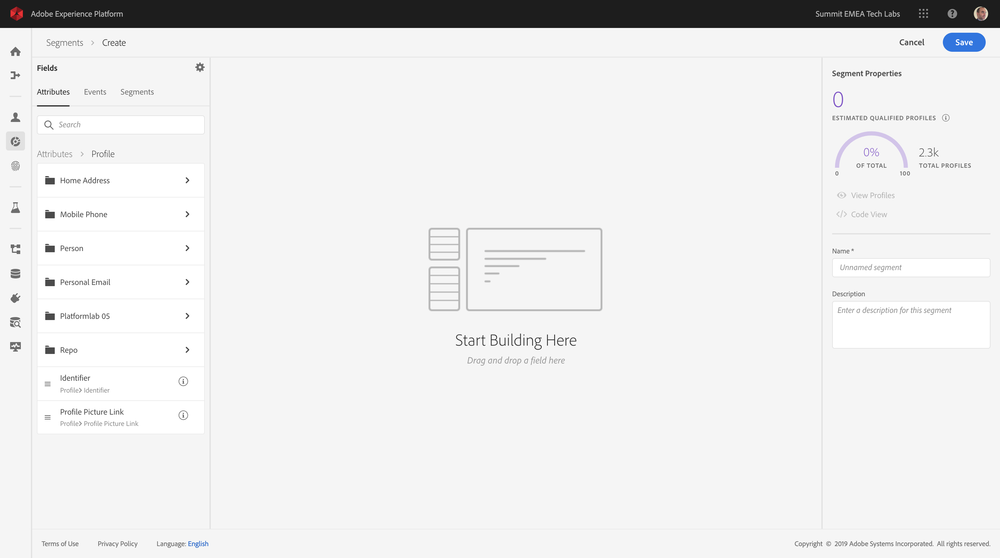

From the Profile-window, you can select Person now.

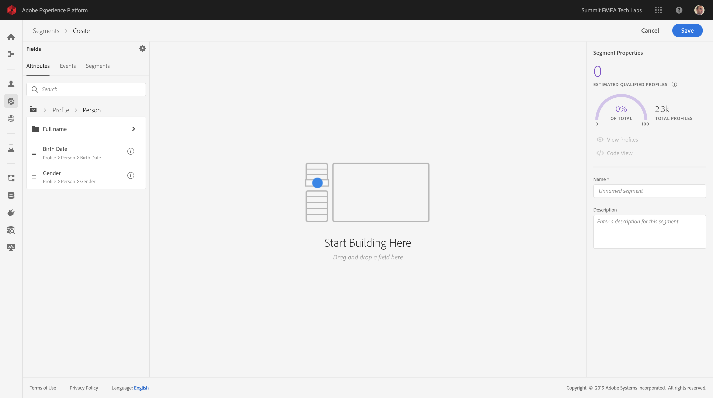

And in Person, you can find the Gender-attribute. Drag the Gender-attribute on the segment builder.

Now you can choose the specific gender out of the pre-populated options. In this case, let's pick "Male".

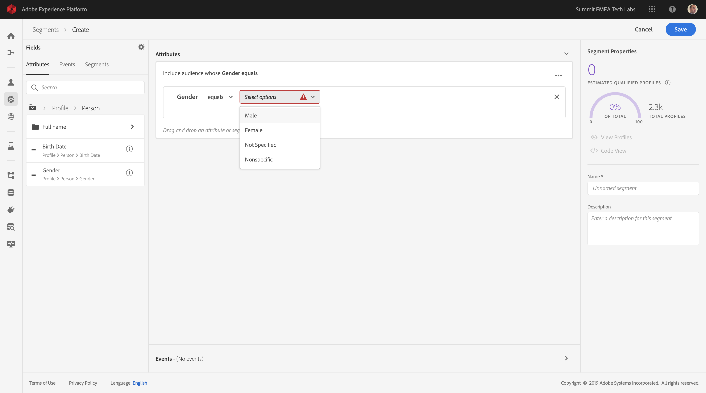

After selecting "Male", you'll see that an estimation of the segment's population is calculated. This is very helpful for a business audience, so that they understand the impact of certain attribute selections on segment size and addressable audience.

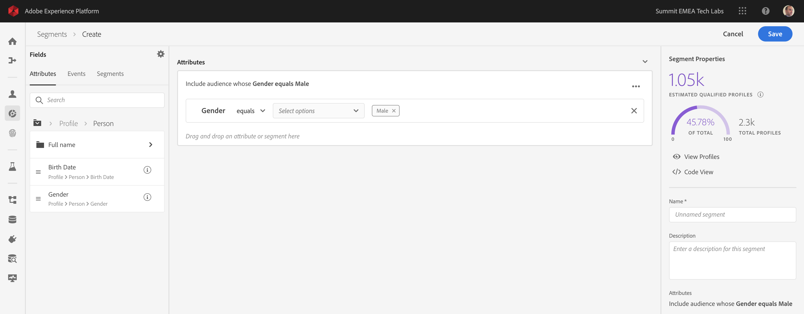

Next, we should refine our segment a bit. I'd like to build a segment out of all male customers that have viewed the "Luma Sport"-page.

To build out this segment, you need to add an Experience Event. You can find all Experience Events by clicking on the ```Events``` - icon in the ```Segments``` - menu bar.

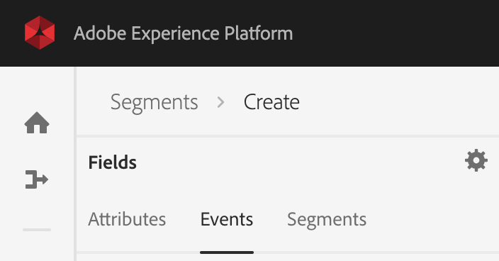

Next, you'll see the top level "Experience Events"-node. Click it.

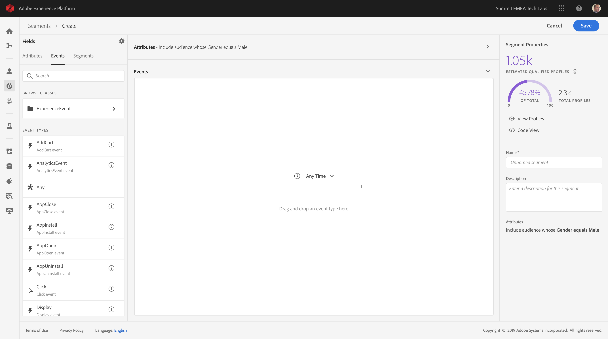

To find customers that have visited the ```Luma Sport``` - page, click on ```ExperienceEvent```.

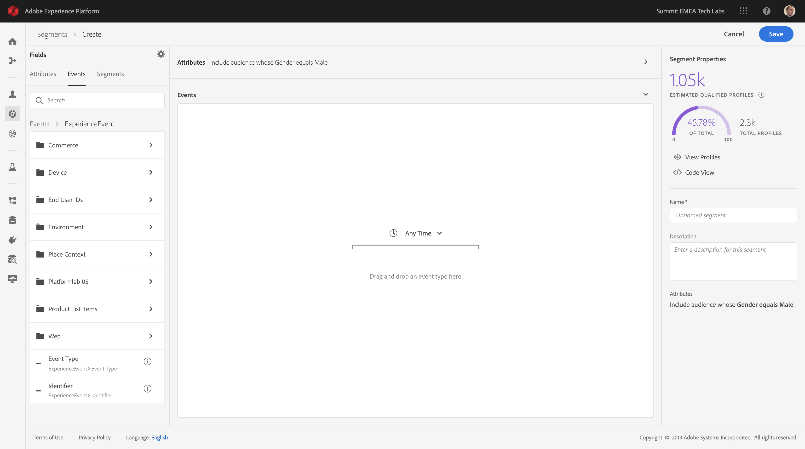

Go to ```Web```.

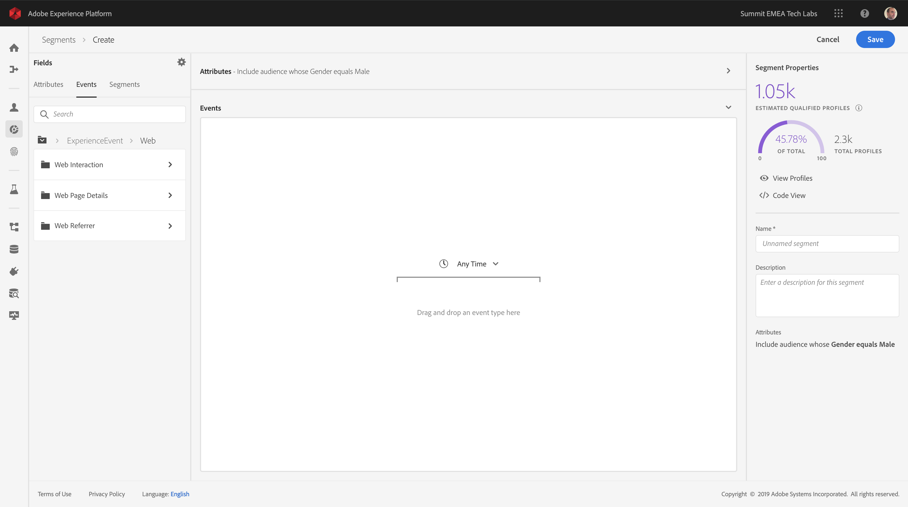

Go to ```Web Page Details```.

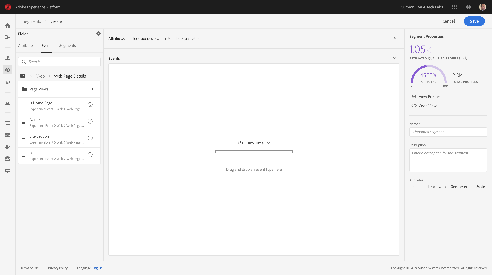

Drag and drop the ```Name```-object from the left ```Web Page Details``` - menu onto the segment builder canvas into the ```Events```- section.

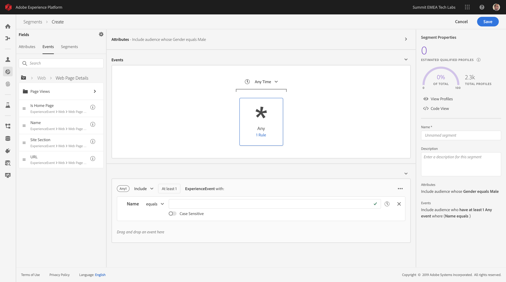

The comparison parameter should be ```equals``` and in the input field, enter ```Luma Sport```.

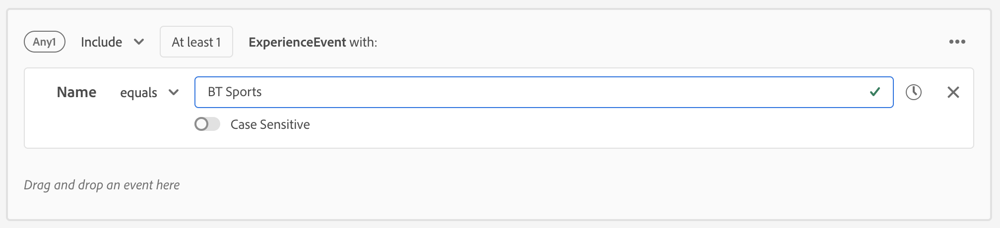

Every time you add an element to the segment builder, the segment population is being dynamically updated every step of the way.

So far, we've only used the UI to build our segment, but there's also a code-option to build a segment.
When building a segment, we're actually composing a PQL query: Profile Query Language. To visualize the PQL code, you can click on the "Code View" switcher in the upper right corner of the segment builder.

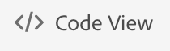

Now you can see the full PQL-statement:

```
person.gender in ["male"] and 
(select var1 from xEvent where var1.web.webPageDetails.name.equals("Luma Sport", false))
```

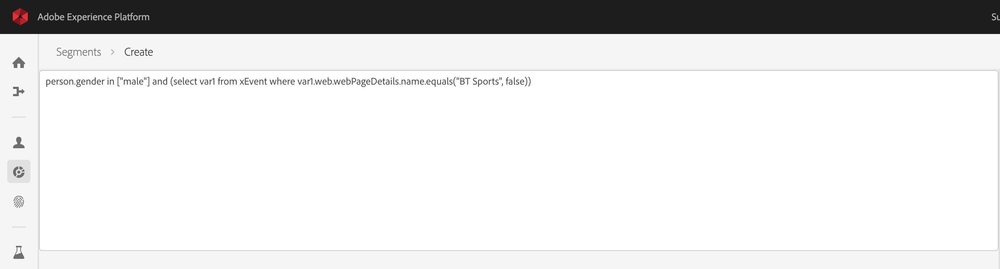

We'll go a bit deeper on PQL at a later stage.

You can also preview a sample of the customer profiles that are part of this segment, by clicking on "Preview Profiles".


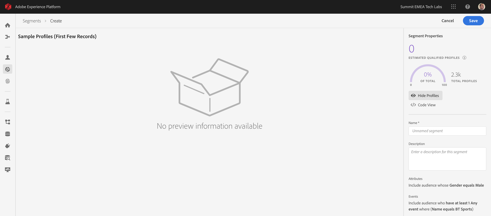

Finally, let's give your segment a name and save it.

As a naming convention, we'll use:

  * **XX** - Male customers with interest in Luma Sport

Please replace **XX** with your computer's number, which you can find on the desktop of your computer.

You can assign the name by clicking on the "Unnamed segment"-text in the upper left corner.

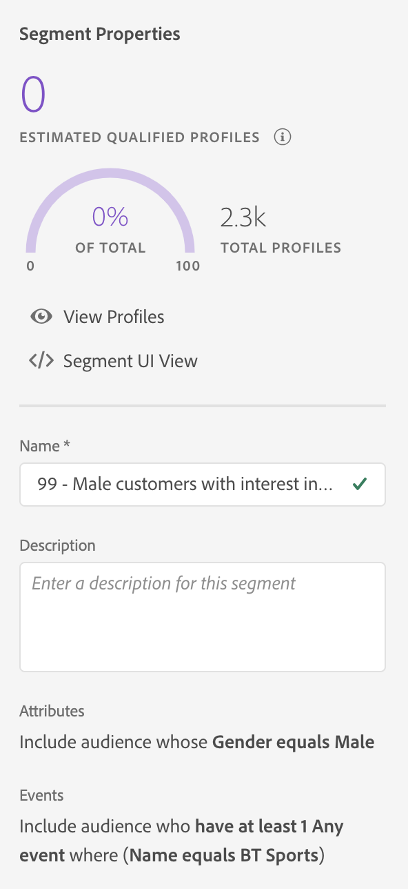

Then, click the ```Save``` - button to save your segment, after which you'll be taken back to the Segment overview - page.

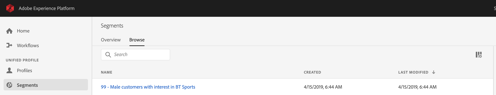

Let's now continue to the next exercise and build a segment through the API.

---

[Next Step: Exercise 5 - Create a segment - API](./ex5.md)