## Exercise 5 - Create a segment - API

In this exercise, you'll use Postman and Adobe I/O to create a segment and store the results of that segment as a dataset, by making use of Adobe Experience Platform's API's.

The URL to login to Adobe Experience Platform is: [https://platform.adobe.com](https://platform.adobe.com)

**Attention!**

Please have a look at your computer's number and memorize it. As part of this exercise you'll need to specify your computer's number when you:

  * Save your segment
  * Create your dataset

 
### Story

In the real-time customer profile, all profile data is shown alongside behavioral and transactional data and the view will also be enriched with existing segment memberships. The data that is shown here comes from anywhere, from any Adobe Solution to any external solution. This is the most powerful view of Adobe Experience Platform: the true Experience System of Record.

### Exercise 5.1 - Create a segment through the Platform API

Go to Postman.

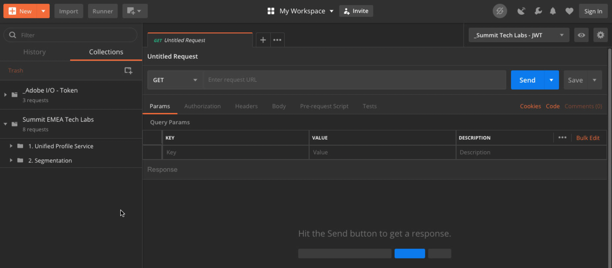

Locate the collection: ```Summit EMEA Tech Labs```. In this collection, you'll see a folder ```2. Segmentation```. We'll be using these calls in this exercise.

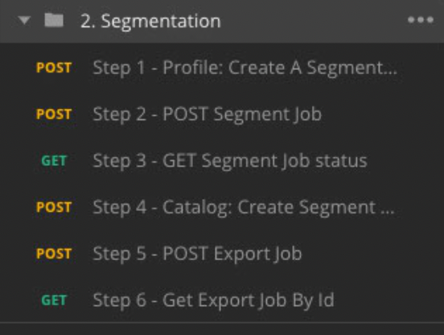

What we'll do next is follow all the required steps to create a segment through the API. We're going to build a simple segment: "**XX** - All Female Customers".

#### Step 1 - Create a Segment Definition

Click on the call named ```Step 1 - Profile: Create A Segment Definition```.

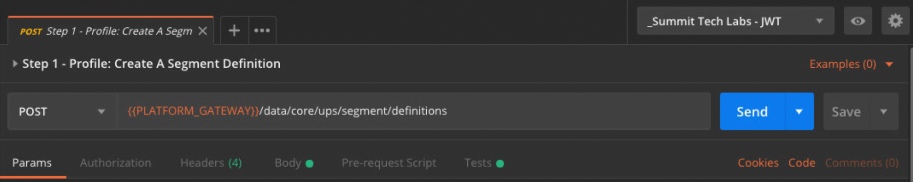

Go the the ```Body``` section of this call.

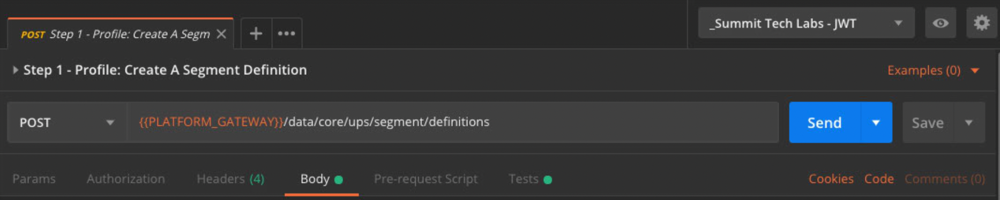

In the ```Body``` of this call, you'll see the following:

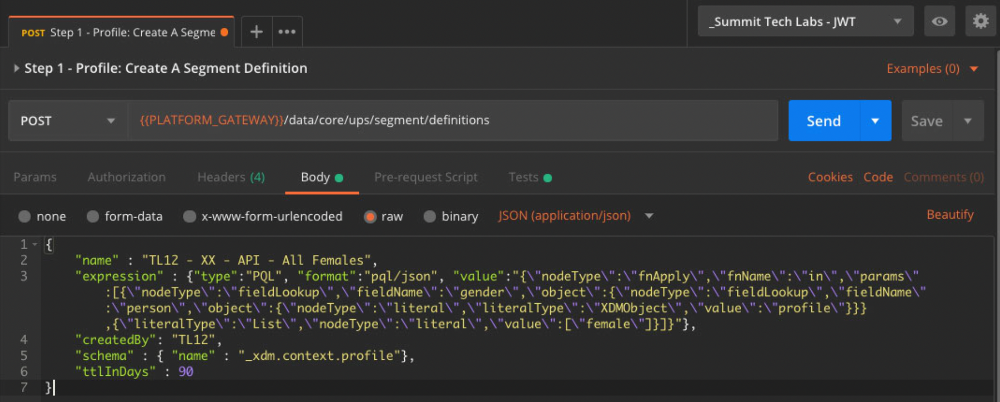

The language used for this call is called ```PQL```: Profile Query Language.
You can find more info and documentation about PQL [here](https://www.adobe.io/apis/experienceplatform/home/profile-identity-segmentation/profile-identity-segmentation-services.html#!api-specification/markdown/narrative/technical_overview/unified_profile_architectural_overview/unified_profile_pql.md). 

Attention: please update the variable **name** in the below call by replacing **XX** with your specific **Computer Number**.

```
{
    "name" : "TL12 - XX - API - All Females",
    "expression" : {"type":"PQL", "format":"pql/json", "value":"{\"nodeType\":\"fnApply\",\"fnName\":\"in\",\"params\":[{\"nodeType\":\"fieldLookup\",\"fieldName\":\"gender\",\"object\":{\"nodeType\":\"fieldLookup\",\"fieldName\":\"person\",\"object\":{\"nodeType\":\"literal\",\"literalType\":\"XDMObject\",\"value\":\"profile\"}}},{\"literalType\":\"List\",\"nodeType\":\"literal\",\"value\":[\"female\"]}]}"},
    "createdBy": "TL12",
    "schema" : { "name" : "_xdm.context.profile"},
    "ttlInDays" : 90
}
```
After adding your specific **Computer Number**, the Body should look similar to this:

```
{
    "name" : "TL12 - 99 - API - All Females",
    "expression" : {"type":"PQL", "format":"pql/json", "value":"{\"nodeType\":\"fnApply\",\"fnName\":\"in\",\"params\":[{\"nodeType\":\"fieldLookup\",\"fieldName\":\"gender\",\"object\":{\"nodeType\":\"fieldLookup\",\"fieldName\":\"person\",\"object\":{\"nodeType\":\"literal\",\"literalType\":\"XDMObject\",\"value\":\"profile\"}}},{\"literalType\":\"List\",\"nodeType\":\"literal\",\"value\":[\"female\"]}]}"},
    "createdBy": "TL12",
    "schema" : { "name" : "_xdm.context.profile"},
    "ttlInDays" : 90
}
```

Now, click the blue ```Send``` - button to create the segment and view the results of that.

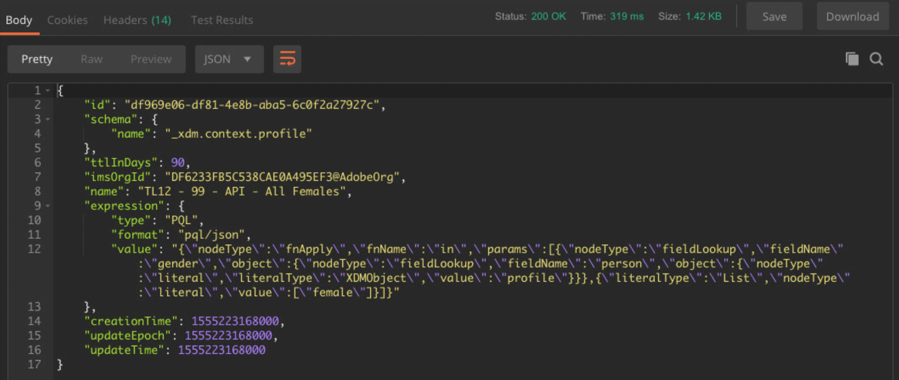

After this step, you can view your Segment Defintion in the Platform UI. To check this, log in to Platform and go to [https://platform.adobe.com/profile/segment](https://platform.adobe.com/profile/segment). 

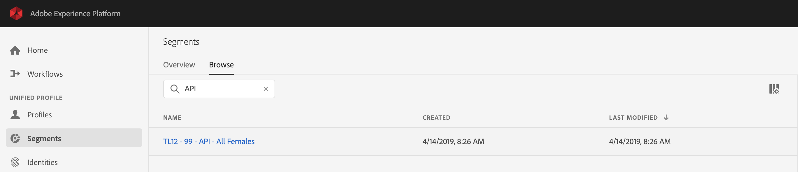

If you edit the Segment Definition for TL12 - **XX** - API - All Females, you'll see the UI-version of your segment query.

#### Step 2 - Create a Segment POST Job

So far, whether done through the UI or the API, you've only built Segment Definitions. Creating a segment definition doesn't mean that the segment has actually run, it only gives you a preview of what the segment could look like in terms of qualifications. At this moment, nobody qualifies for this segment. To make people qualify, the segment needs to run.

Let's now POST a Segment Job.

Go to Postman.


In your Postman-collection, click on the call named ```Step 2 - POST Segment Job``` to open it.

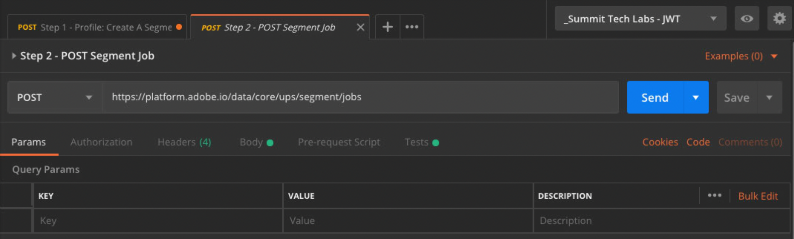

Click on the blue ```Send``` - button.

You should see a similar result:

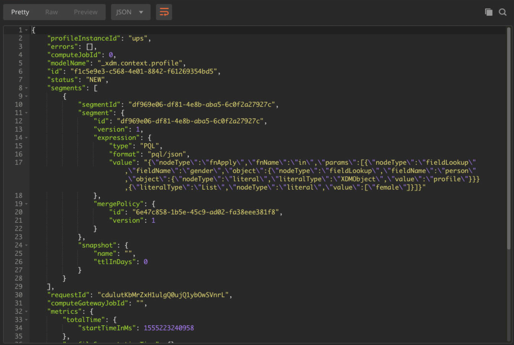

This Segment Job is now running, and this may take some time. In Step 3, you'll be able to check the status of this job.


#### Step 3 - GET Segment Job status

Go to Postman.


In your Postman-collection, click on the call named ```Step 3 - GET Segment Job status```.

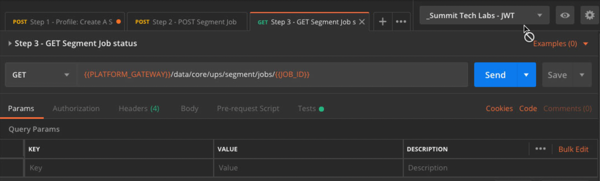

Click on the blue ```Send``` - button.

You should see a similar result:

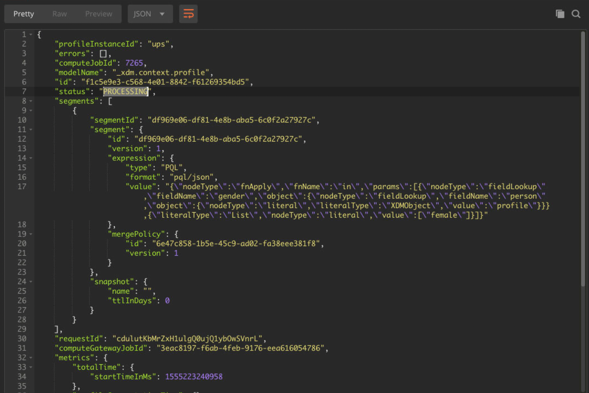

In this example, the ```status``` of the job is set to ```PROCESSING```.

Repeat this call by clicking the blue ```Send``` - button every couple of minutes until the ```status``` is set to ```SUCCEEDED```.

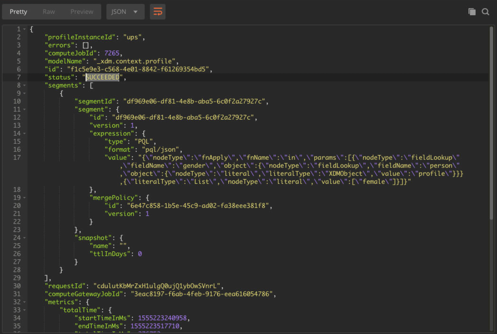

Once the status is ```SUCCEEDED```, you can continue to Step 4. Please wait to proceed until the status is ```SUCCEEDED```, otherwise the following steps won't work.

#### Step 4 - Create a dataset to hold the results of your Segment Job

Once the segment has run, we're able to process the output of the segment job and save it in a dataset. By saving our output into a dataset, it becomes part of an exportable list that in this case, contains all female customers.

Go to Postman.


In your Postman-collection, click on the call named ```Step 4 - Catalog: Create Segment Dataset```.

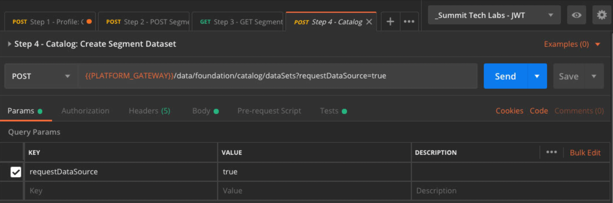

In the Body of this call, you'll see the following:

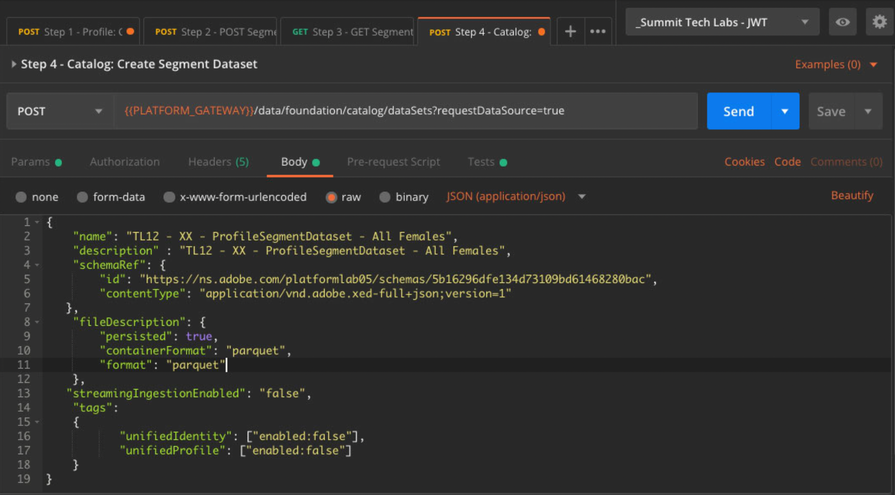

Attention: please update the variable **name** and **description** in the below call by replacing **XX** with your specific **Computer Number** each time.

```
{
    "name": "TL12 - XX - ProfileSegmentDataset - All Females",
    "description" : "TL12 - XX - ProfileSegmentDataset - All Females",
    "schemaRef": {
        "id": "https://ns.adobe.com/platformlab05/schemas/5b16296dfe134d73109bd61468280bac",
        "contentType": "application/vnd.adobe.xed-full+json;version=1"
   },
    "fileDescription": {
        "persisted": true,
        "containerFormat": "parquet",
        "format": "parquet"
    },
   "streamingIngestionEnabled": "false",
    "tags":
    {
           "unifiedIdentity": ["enabled:false"],
           "unifiedProfile": ["enabled:false"]
    }
}
```

After adding your specific **Computer Number**, the ```Body``` should look similar to this:

```
{
    "name": "TL12 - 99 - ProfileSegmentDataset - All Females",
    "description" : "TL12 - 99 - ProfileSegmentDataset - All Females",
    "schemaRef": {
        "id": "https://ns.adobe.com/platformlab05/schemas/5b16296dfe134d73109bd61468280bac",
        "contentType": "application/vnd.adobe.xed-full+json;version=1"
   },
    "fileDescription": {
        "persisted": true,
        "containerFormat": "parquet",
        "format": "parquet"
    },
   "streamingIngestionEnabled": "false",
    "tags":
    {
           "unifiedIdentity": ["enabled:false"],
           "unifiedProfile": ["enabled:false"]
    }
}
```

Now, click the blue ```Send``` - button to create the dataset and view the results of that.

You will see a similar response like the one below, which contains the Dataset ID of the dataset that was just created.

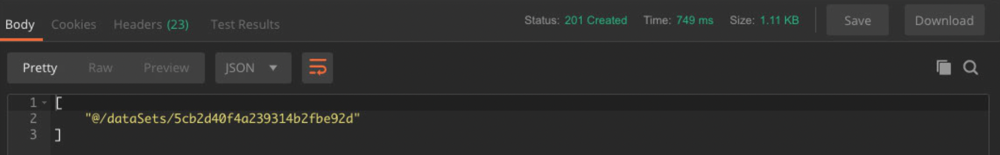

You've now successfully created a dataset in Platform through the API.

You can now view your dataset in the Platform UI. To check this, log in to Platform and go to [https://platform.adobe.com/dataset](https://platform.adobe.com/dataset). 

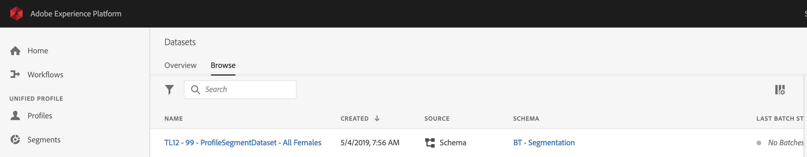

The dataset you created doesn't have data yet, you'll do that in Step 5.

#### Step 5 - Create an Export Job

We now have a successful Segment Job and a dataset in Platform to store the result of the Segment Job. In this step, you need to Start a Job to Export that information.

Go to Postman.


In your Postman-collection, click on the call named ```Step 5 - POST Export Job```.

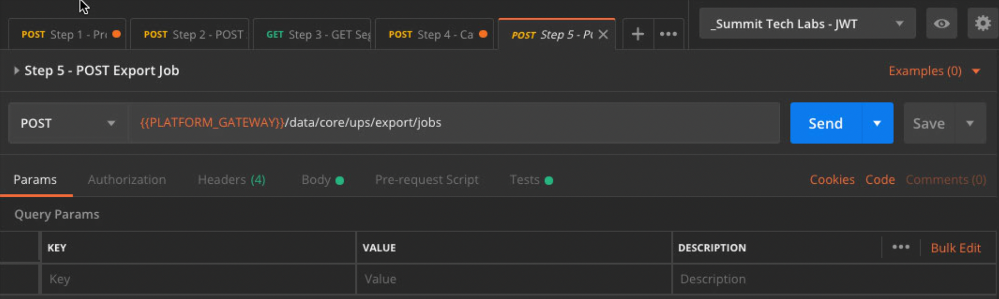

Click on the blue ```Send``` - button.

You should see a similar result:

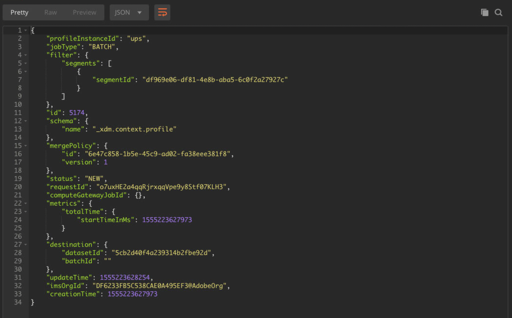

The Export Job to the dataset is now running. Go to Step 6 to check up on the status of this job.

#### Step 6 - Verify Job Status

Go to Postman.


In your Postman-collection, click on the call named ```Step 6 - Get Export Job By Id```.

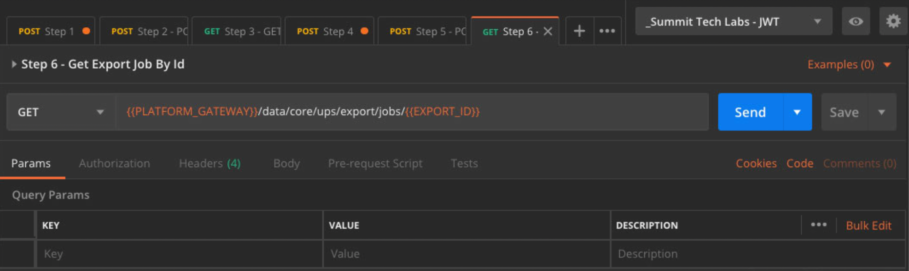

Click on the blue ```Send```-button.

You should see a similar result:

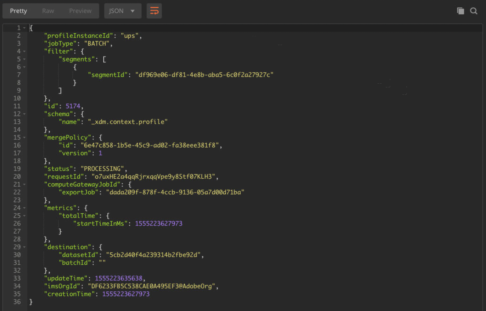

In this example, the ```status``` of the job is set to ```PROCESSING```.

Repeat this call by clicking the blue ```Send``` - button every couple of minutes until the ```status``` is set to ```SUCCEEDED```. 

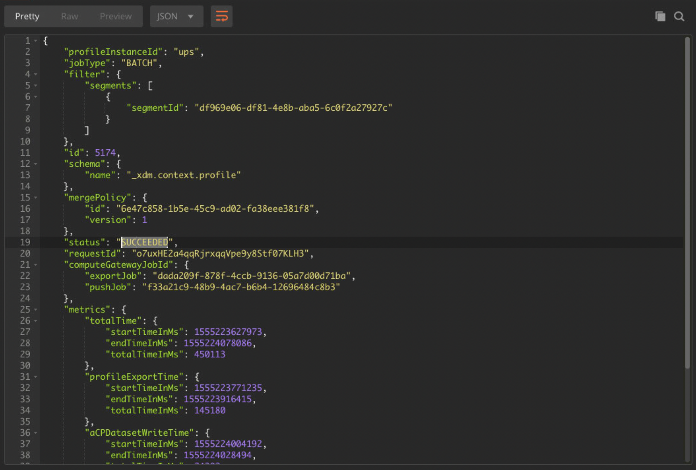

Once the status is ```SUCCEEDED```, you can now view your Segment Definition's data in the Platform UI. To check this, log in to Platform and go to [https://platform.adobe.com/datasets](https://platform.adobe.com/datasets). 

Click on your dataset ```TL12 - XX - ProfileSegmentDataset - All Females```. You should see a batch that is currently ```Loading```.

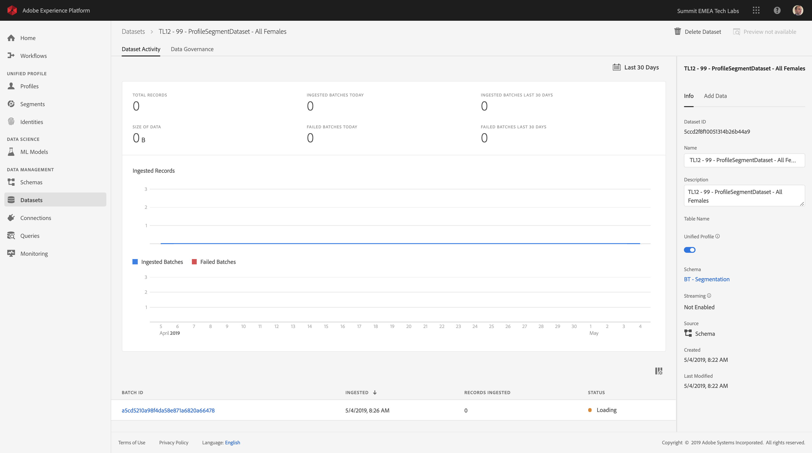

After a couple of minutes, the status of the batch will become ```Success```.

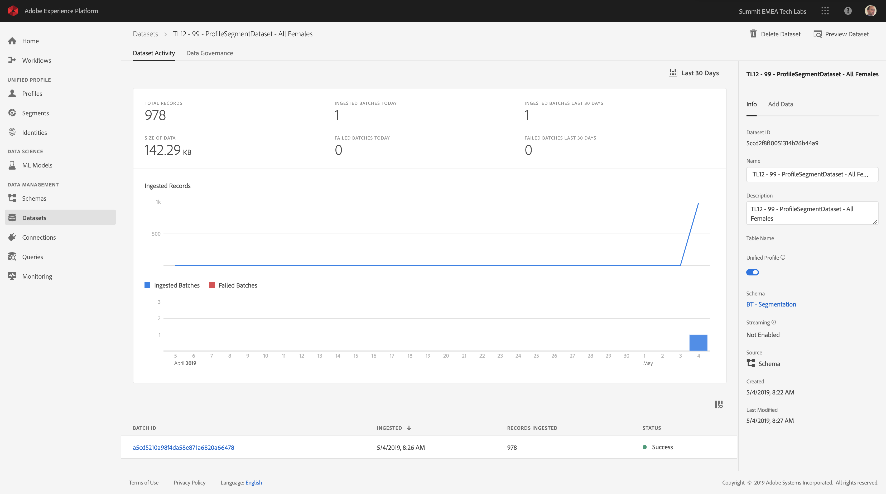

You're now able to preview the data in that dataset:

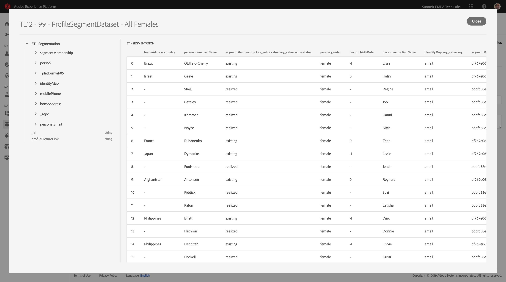

You can also visually check to see that all of the people in this segment have a gender of ```female```.

Congrats, you've successfully completed the Segmentation exercise. Let's now have a look how the Real-Time Customer Profile can be activated across the enterprise.

---

[Next Step: Exercise 6 - See your Real-Time Customer Profile in action in the Luma Call Center](./ex6.md)