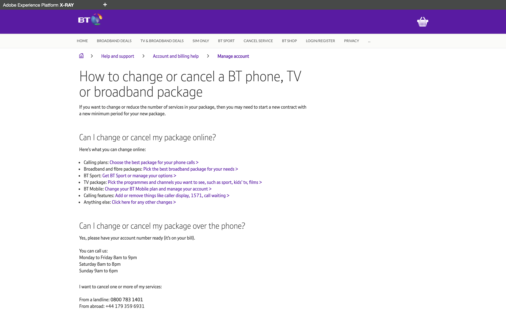
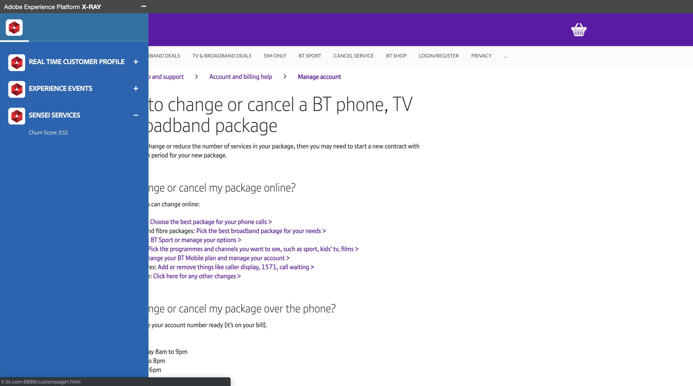
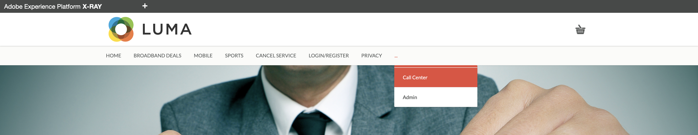
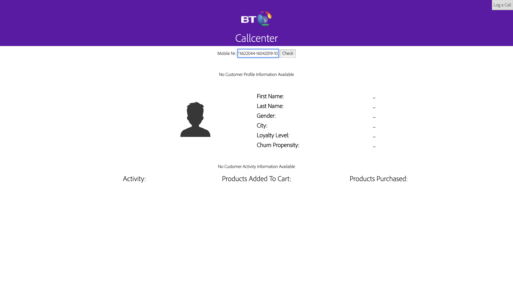
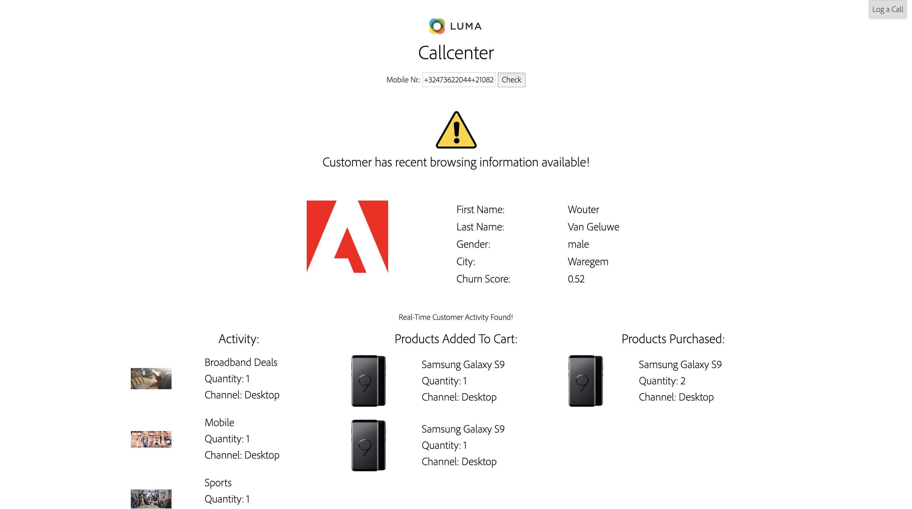
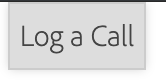
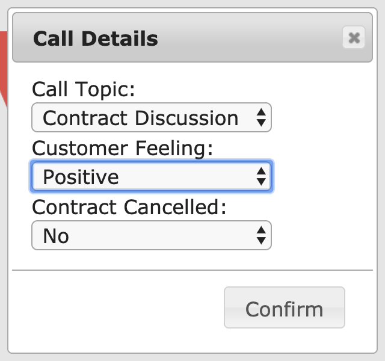
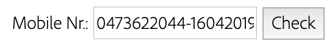
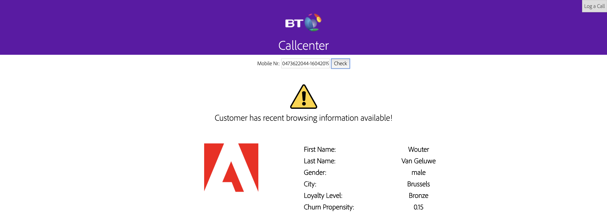

## Exercise 6 - See you Real-Time Customer Profile in action in the Luma Call Center

In this exercise, you'll follow a script and walk through the Luma website on your local machine.

The URL to access the Luma website is: [http://localhost:8888](http://localhost:8888)
 
### Story
In this exercise, the goal is to have you walk through the Luma customer journey and act like a real customer.

You can access the demo website by going to [http://localhost:8888](http://localhost:8888)

On this website, we've implemented Adobe Experience Platform. Every activity is considered an Experience Event and is sent like that to Adobe Experience Platform in real-time, and hydrates the Unified Profile.

In the journey, you started as an anonymous customer who was browsing the Luma website and after a couple of steps, you became a known customer which hydrated Adobe Experience Platform's Real-Time Customer Profile.

Let's now see the information on your Customer Profile can be used to impact the customer experience & a company's bottom line.


### Exercise 6.1 - Visit the Cancel Service - page on the Luma website 

Let's start.

Go to to [http://localhost:8888](http://localhost:8888).

In the site's menu, click on Cancel Service to visit that page.



Open the X-ray panel and go to Sensei Services. See what kind of impact your visit to the ```Cancel Service``` - page has had.



### Exercise 6.2 - Simulate a call the Luma Call Center

Go to to [http://localhost:8888](http://localhost:8888).

In the site's menu, click on the 3 dots "..." and then select Call Center to go to the Call Center simulator.



Enter the phone number that you previously used when creating your account and click the "Check"-button.



You'll now see the information that would ideally be displayed in Luma's Call Center, so that the Call Center employees have all relevant information available immediately when speaking to a customer.



To simulate the end of a call with the call center, you should log the call by clicking on the "Log a Call"-button after which a popup window will open.



Make a random selection of the Call Topic and the Customer Feeling and click "Confirm" to provide Adobe Experience Platform with the information.



Every choice that you make on the Call Details - screen will have an impact on the Churn Score, which may be negative of positive. You can verify the impact by clicking the ```Check``` - button again on the Call Center screen.



After clicking the ```Check``` - button again, you'll see an updated Churn Score.



Congrats, you've successfully finished this module!

---
