# Exercise 1 : Getting Started

## Objectives

- Log in to Adobe Experience Platform
- Browse datasets
- Introduction to Query Service
- Connect PSQL client to Query Service

## Exercise 1.1 - Getting familiar with the Adobe Experience Platform UI

Make sure you are logged in into the Adobe Experience Platform UI and navigate to the Navigate to the Adobe Experience Platform Login Page: https://platform.adobe.com

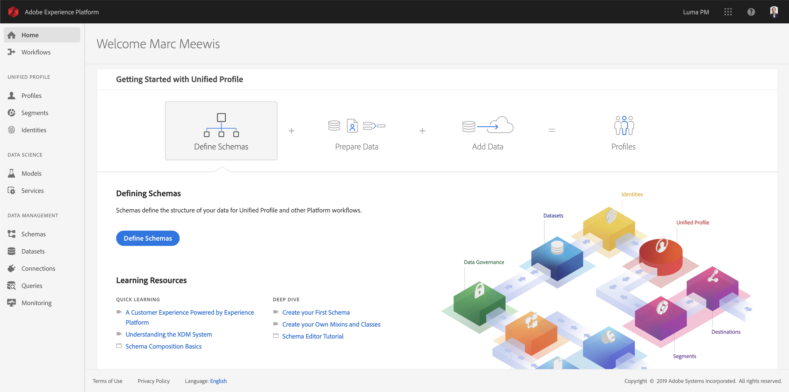

## Exercise 1.2 - Explore data on the platform

Bringing data from different channels is a tough task for any brand. And in this exercise, BT customers are engaging with BT on its website, on its mobile app, purchase data is collected by BT’s Point of Sale system, and they have CRM and Loyalty data. BT is using Adobe Analytics and Adobe Launch to capture data across its website, mobile app as well as POS system, so this data is already flowing into Adobe Experience Platform. Lets begin with exploring all the data for BT that already exists on the Platform.

- Click on Datasets element in the left navigation panel in the Platform UI

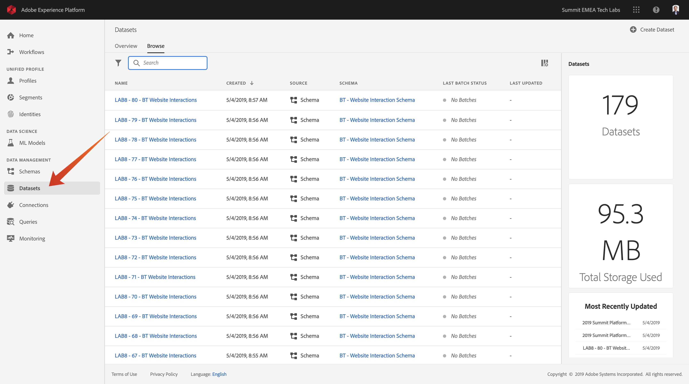

BT is using Adobe Analytics to capture Web Behavioral data and this data is available in the platform in “BT Website Interactions” dataset. Search for “BT Website Interactions”. As you can see the schema for this dataset if “Experience Event”. Experience Event schema is our standard schema to describe any activity done, which works well to capture web, mobile, IOT and other interaction data, such as BT's callcenter interaction data.

BT’s Callcenter Interaction data is captured in “BT Call Center Interactions” dataset. Search for “BT Call Center Interactions” (1) data in search box. Click on dataset (2) name to get dataset details.

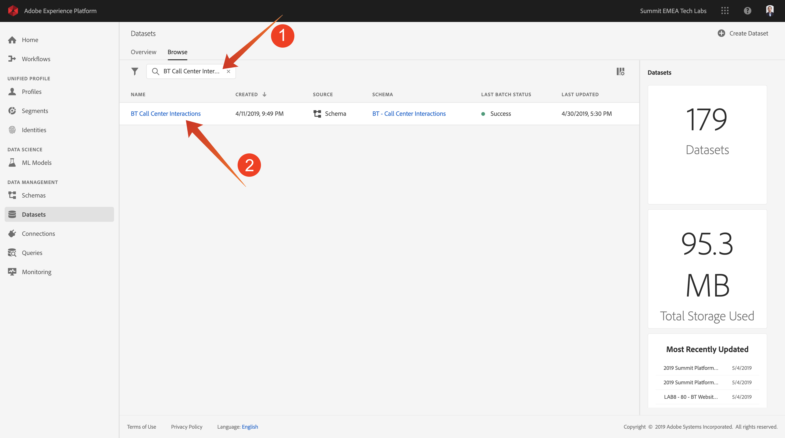

After clicking the dataset, you will get an overview of the dataset acticity such as ingested and failed batches.

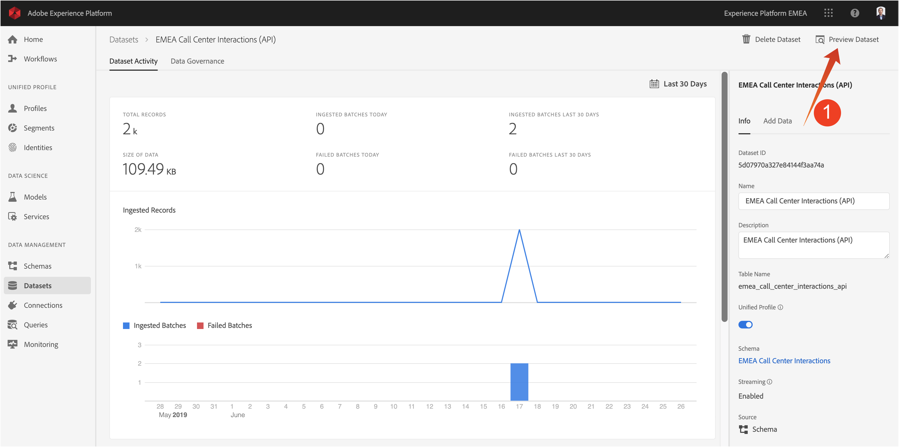

Click on “Preview Dataset” to see a sample of the data stored in "BT Call Center Interactions” dataset. The left panel shows schema structure for this dataset.

You can open the schema structure by clicking on ">" (1). The see an data structure element's data, click on its name (2)

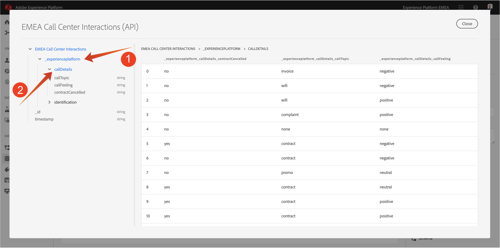

Close the "Preview Dataset" window.

# Exercise 1.3 - Introduction to Query Service

You will be working with the Alpha version of the Query Service today.

Query Service is accessed by clicking on "Queries" toward the bottom of the left navigation.

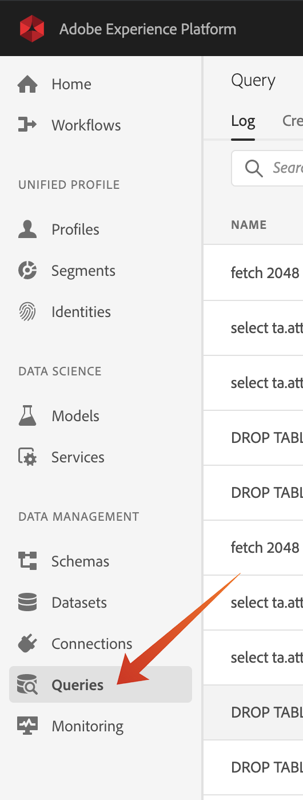

You will see the Query List page, which provides you a list of all the queries run in this organization, with the latest at the top. Enter "bt" (1) in the search field:

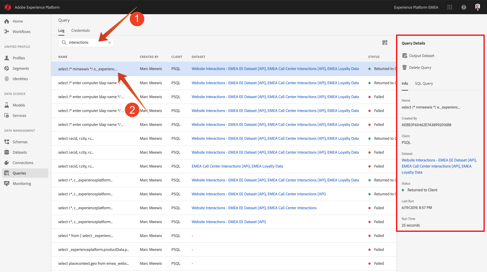

Click on a SQL query (2) from the list and observe the details provided in the right rail

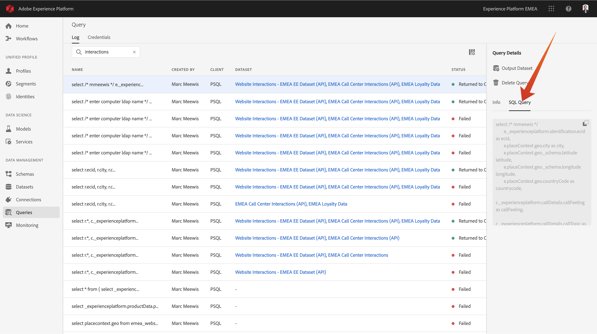

You can scroll the window to see the entire query, or you can click on the icon highlighted below to copy the entire query to your notepad. You do not have to copy the query at this time.

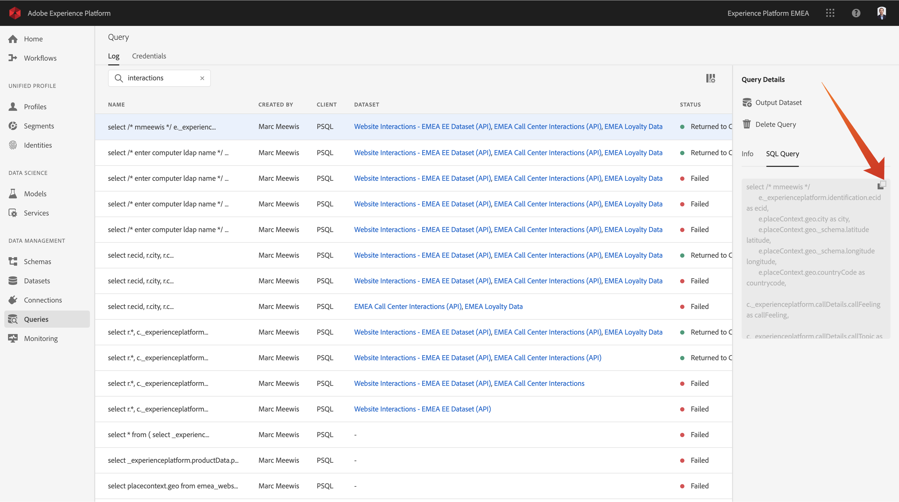

You cannot only see the queries that have been executed, but this UI lets you create new datasets from queries. These datasets can be linked to Adobe Experience Platform Real-Time Customer Profile or can be used as input for your Adobe Experience Platform Data Science Workspace. For the SQL people in the lab, in the realtional database world, this is also known as "create table as select". We will dicuss this capablity of persisting query results in exercise 4 of this lab.

## Exercise 1.4 - Connect PSQL Client to Query Service

Future releases of Query Service will include a web interface for sumbitting, managing, and scheduling queries. This Alpha version requires that you connect an external client in order to submit queries. Query Service supports clients with a driver for PostgreSQL. In this lab we will be using PSQL, a command-line interface, and Power BI. In this exercise we will connect PSQL. (We'll connect Power BI a little later.)

Click on "Connection Info".

You will see the screen below. The Configuration screen provides server information and credentials for authenticating to Query Service. For now, we will focus on the right side of the screen which contains a connect command for PSQL. Click on the Copy button to copy the command to your clipboard.

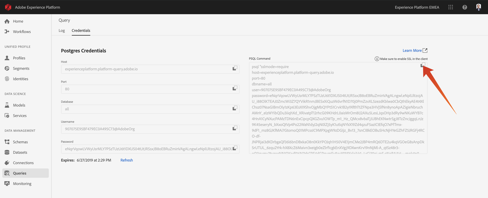

Open the command line by hitting the windows key and typing cmd (1) and then clicking on the Command Prompt (2) result.

Paste the connect command that you have copied from the Query Service UI and hit enter in the command prompt window:

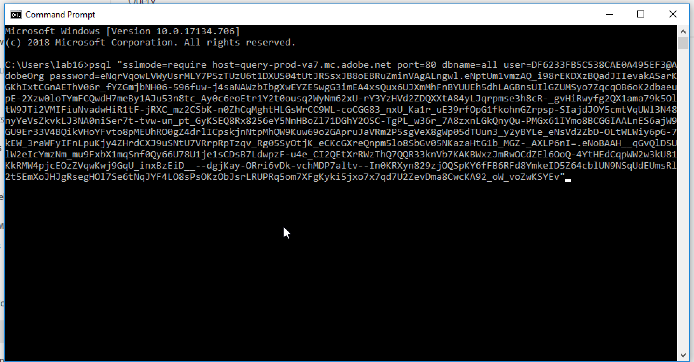

For the remainder of the lab, there will be quite some interaction with this window. We will refer to it as your **PSQL command-line interface**.

You are now connected to Query Service using PSQL. You can verify that you are connected when you see a prompt that looks like this:

Now you are ready to start submitting queries!

Next [Exercise 2 - Using the Query Service](../exercises/2-using-query-service.md)

