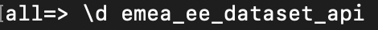
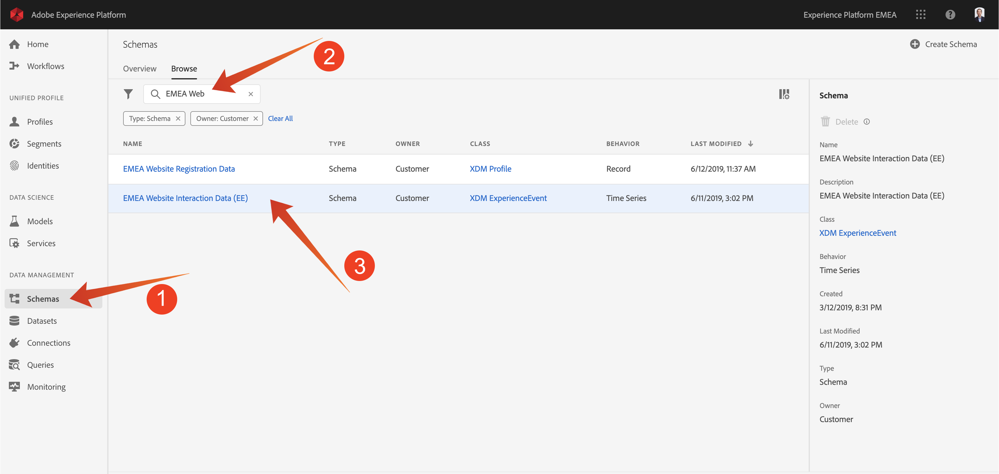
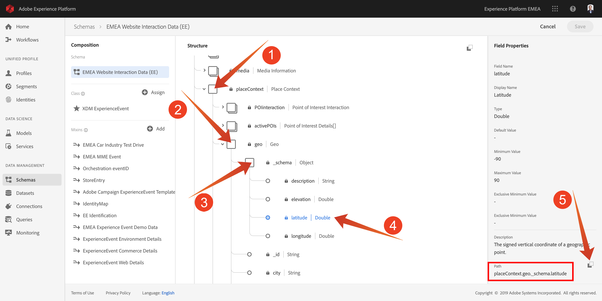

# Exercise 2 - Using the Query Service

## Objective

- Find and explore datasets
- Learn how to address Experience Data Models objects and attributes in your queries


## Lesson Context

In this lesson you will learn how to use PSQL to retrieve information about the available datasets, how to write a queries for Experience Data Model (XDM), and write your first simple reporting queries using the Query Service and BT datasets.

## Exercise 2.1

In this exercise you will learn about the methods to retrieve information about the available datasets and how to properly retrieve data with a query from an XDM dataset.

All the "bt" datasets hat we have explored via Adobe Experience Platform UI in the beginning of exercise 1, are also available for access via a SQL interface as tables. To list those tables you can use the "show tables;" command. 

Execute **show tables;** in your **PSQL command-line interface**. (do not forget to end your command with a semicolon).

Copy **show tables;** and paste it at the **all >** prompt:


You will see the following result:

```text
all->
all-> show tables;
                      name                       |        dataSetId         |                     dataSet                     | description | resolved
-------------------------------------------------+--------------------------+-------------------------------------------------+-------------+----------
 bt_call_center_interactions                     | 5caf9a4e9c1b6e14b1fce569 | BT Call Center Interactions                     |             | false
 bt_crm_onboarding                               | 5cb172b02bebb714b3bb1e53 | BT CRM Onboarding                               |             | false
 bt_loyalty_data                                 | 5cb4459dd204f214b1383edf | BT Loyalty Data                                 |             | false
 bt_website_interactions                         | 5cb03f6baa290114b4ea247e | BT Website Interactions                         |             | false
 bt_website_registrations                        | 5caecececebc5914b2019607 | BT Website Registrations                        |             | false
 rawingestdataset_5c918506f062e300008b4993       | 5c9185066129971517cb381c | rawIngestDataset-5c918506f062e300008b4993       |             | false
 recommendations_input_dataset                   | 5c927f59012c9615168ba7ec | Recommendations Input Dataset                   |             | false
 recommendations_output_dataset                  | 5c927bd95a5f721515516861 | Recommendations Output Dataset                  |             | false
 tl12___99___profilesegmentdataset___all_females | 5cb2d40f4a239314b2fbe92d | TL12 - 99 - ProfileSegmentDataset - All Females |             | false
 x2019_summit_platform_lab_5_midvalues_1         | 5c89949bc666e015162a89bb | 2019 Summit Platform Lab 5 midValues            |             | false
 x2019_summit_platform_lab_5_postvalues_1        | 5c89949bef707515181cf97a | 2019 Summit Platform Lab 5 postValues           |             | false
(11 rows)


all=>
```

To see the "root" schema of a table, like for example "bt_website_interactions", you use "\d" command. 

Copy **\d bt_website_interactions** and paste it at the **all >** prompt in your **PSQL command-line interface**.:



The result should look like:

```text
all=>
all=> \d bt_website_interactions
                           Table "public.bt_website_interactions"
      Column      |                  Type                  | Collation | Nullable | Default
------------------+----------------------------------------+-----------+----------+---------
 timestamp        | timestamp                              |           |          |
 _id              | text                                   |           |          |
 productlistitems | anyarray                               |           |          |
 commerce         | bt_website_interactions_commerce       |           |          |
 web              | bt_website_interactions_web            |           |          |
 placecontext     | bt_website_interactions_placecontext   |           |          |
 identitymap      | pg_proc                                |           |          |
 _platformlab05   | bt_website_interactions__platformlab05 |           |          |
 environment      | bt_website_interactions_environment    |           |          |


all=>
```

To query some information about where a product was viewed, we will select the "geo" information from bt_website_interactions.

Copy the statement below and paste it at the **all >** prompt in your **PSQL command-line interface** and hit enter:

```sql
select placecontext.geo
from   bt_website_interactions
where  _platformlab05.productData.productInteraction = 'productView'
limit 1;
```

In your query result, you will notice that columns in the Experience Data Model (XDM) can be complex types and not just scalar types. In the query above we would like to identify geo locations where a "productView" did occur. To identify a "productView" we have to navigate through the XDM model using the "." (dot) notation.

```text
all=> select placecontext.geo
all-> from   bt_website_interactions
all-> where  _platformlab05.productData.productInteraction = 'productView'
all-> limit 1;
                  geo                   
----------------------------------------
 ("(50.4271996,3.989666)",Belgium,Mons)
(1 row)

all=>
```

Notice the result is a flattended object rather than a single value? The "placecontext.geo" object contains four attributes: schema, country and city. And when an object is declared as a column it will return the entire object as a string. The XDM schema may be more complex than what you are familiar with but it's very powerful and was architected to support many solutions, channels, and use cases.

To select the individual properties of an object, you use the "." (dot) notation.

Copy the statement below and paste it at the **all >** prompt in your **PSQL command-line interface**:

```sql
select placecontext.geo._schema.longitude
      ,placecontext.geo._schema.latitude
      ,placecontext.geo.city
      ,placecontext.geo.countryCode
from   bt_website_interactions
where  _platformlab05.productData.productInteraction = 'productView'
limit 1;
```

The result of the above query should look like:

```text
The result is now a set simple values:

all=> select placecontext.geo._schema.longitude
all->       ,placecontext.geo._schema.latitude
all->       ,placecontext.geo.city
all->       ,placecontext.geo.countryCode
all-> from   bt_website_interactions
all-> where  _platformlab05.productData.productInteraction = 'productView'
all-> limit 1;
 longitude |  latitude  | city | countrycode 
-----------+------------+------+-------------
  3.989666 | 50.4271996 | Mons | Belgium
(1 row)

all=> 
```

Don't worry, there is an easy way to obtain the path towards a specific property. In the following part you will learn how. 

You will need to edit a query, so let's first open notepad, click "search"-icon (1) in the windows toolbar, type **notepad** in the "search"-field (2), click (3) the "notepad" result:


Copy the following statement to notepad:

```sql
select <your_attribute_path_here>
from   bt_website_interactions
where  _platformlab05.productData.productInteraction = 'productView'
limit 1;
```

The result should look like:


Go back to your Adobe Experience Platform UI (should be open in your browser) or navigate to http://platform.adobe.com.

Select "Schemas" (1), enter **bt** in the "search"-field (2) and select **BT - Website Interaction Schema** from the list.



Explore the XDM model for "BT - Website Interaction Schema", by clicking on de the object, you can expand the tree, do this for "placecontext" (1), "geo" (2) and "schema" (3). When you select the actual attribute "longitude" (4), you will see the complete path in the highlighted red box. To copy the attribute's path, click on the copy path icon (5).



Switch to you notepad window and remove **<your_attribute_path_here>** from the first line. Position your cursor after "select" on the first line and paste (CTRL-V). 

The result should like like:


Select the statement in notepad:


Copy the modified statement from notepad and paste it at the **all >** prompt in your **PSQL command-line interface** and hit enter:


The result should look like:

```text
all=> 
all=> select placeContext.geo._schema.longitude
all-> from   bt_website_interactions
all-> where  _platformlab05.productData.productInteraction = 'productView'
all-> limit 1;
 longitude 
-----------
  3.989666
(1 row)

all=> 
all=> 
all=> 
```

Next [Exercise 3 - Queries, queries, queries...  and churn analysis](../exercises/3-queries.md)
