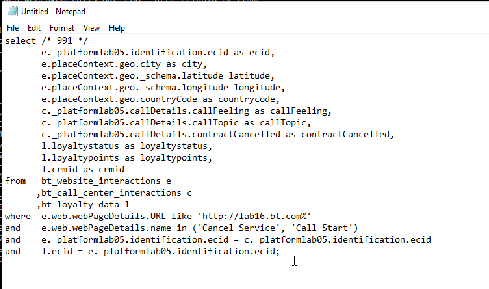

# Exercise 3 - Queries, queries, queries,... and churn analysis

## Objective

- Write queries for data analyses
- Write SQL queries combining online, callcenter and loyalty data avialable in Adobe Experience Platform
- Learn about Adobe Defined Functions

## Lesson Context

In this exercises you will write queries to analyse product views, product funnels, churn etc.

All queries listed in this chapter will be executed in your **PSQL command-line interface**. You should copy (CTRL-c) the statement blocks indicated with **SQL** and paste (CTRL-v)them in the **PSQL command-line interface**. The **Query Result** blocks show the pasted SQL statement and the associated query result.

## Exercise 3.1

Write basic queries for data analysis

### Timestamp

Data captured in Adobe Experience Platform is time stamped. The "timestamp" attribute allows you to analyse data over time.

How many product views do we have on a daily basis? 

**SQL**
```sql
select date_format( timestamp , 'yyyy-MM-dd') AS Day,
       count(*) AS productViews
from   bt_website_interactions
where  web.webPageDetails.URL like 'http://lab16.bt.com%'
and    _platformlab05.productData.productInteraction = 'productView'
group by Day
limit 10;
```

Copy the statement above and execute it in your **PSQL command-line interface**.

**Query Result**
```text
all=> 
all=> select date_format( timestamp , 'yyyy-MM-dd') AS Day,
all->        count(*) AS productViews
all-> from   bt_website_interactions
all-> where  web.webPageDetails.URL like 'http://lab16.bt.com%'
all-> and    _platformlab05.productData.productInteraction = 'productView'
all-> group by Day
all-> limit 10;
    Day     | productViews 
------------+--------------
 2019-04-15 |          220
(1 row)

all=> 
```

### Top 5 products viewed

What are the top 5 products viewed?

**SQL**
```sql
select _platformlab05.productData.productName, count(*)
from   bt_website_interactions
where  web.webPageDetails.URL like 'http://lab16.bt.com%'
and    _platformlab05.productData.productInteraction = 'productView'
group  by _platformlab05.productData.productName
order  by 2 desc
limit 5;
```

Copy the statement above and execute it in your **PSQL command-line interface**.

**Query Result**
```text
all=> 
all=> select _platformlab05.productData.productName, count(*)
all-> from   bt_website_interactions
all-> where  web.webPageDetails.URL like 'http://lab16.bt.com%'
all-> and    _platformlab05.productData.productInteraction = 'productView'
all-> group  by _platformlab05.productData.productName
all-> order  by 2 desc
all-> limit 5;
              productname              | count(1) 
---------------------------------------+----------
 Google Pixel XL 32GB Black Smartphone |       80
 Samsung Galaxy S8                     |       53
 SIM Only                              |       49
 Samsung Galaxy S7 32GB Black          |       38
(4 rows)

all=> 
```

### Product Interaction funnel, from viewing to buying

**SQL**
```sql
select _platformlab05.productData.productInteraction, count(*)
from   bt_website_interactions
where  web.webPageDetails.URL like 'http://lab16.bt.com%'
and    _platformlab05.productData.productInteraction is not null
group  by _platformlab05.productData.productInteraction;
```

Copy the statement above and execute it in your **PSQL command-line interface**.

**Query Result**
```text
all=> 
all=> select _platformlab05.productData.productInteraction, count(*)
all-> from   bt_website_interactions
all-> where  web.webPageDetails.URL like 'http://lab16.bt.com%'
all-> and    _platformlab05.productData.productInteraction is not null
all-> group  by _platformlab05.productData.productInteraction;
 productinteraction | count(1) 
--------------------+----------
 productView        |      220
 productAddToCart   |       69
 productPurchase    |       32
(3 rows)

all=> 
```


### Identify visitors with risk to Churn (visit page => Cancel Service)

**SQL**
```sql
select distinct _platformlab05.identification.ecid
from   bt_website_interactions
where  web.webPageDetails.URL like 'http://lab16.bt.com%'
and    web.webPageDetails.name = 'Cancel Service'
group  by _platformlab05.identification.ecid
limit 10;
```

Copy the statement above and execute it in your **PSQL command-line interface**.

**Query Result**
```text
all=> select distinct _platformlab05.identification.ecid
all-> from   bt_website_interactions
all-> where  web.webPageDetails.URL like 'http://lab16.bt.com%'
all-> and    web.webPageDetails.name = 'Cancel Service'
all-> group  by _platformlab05.identification.ecid
all-> limit 10;
               ecid
----------------------------------
 99516628413897060425700415154342
 91763815590020360733427642960635
 49348861591433471218443847444976
 49287767312129373427397693621930
 20062244970293662376413766742043
 18339366524362419505670622197109
 43830014915420701048402127622326
 78905085286144552633821925988378
 54223680470935763480189002822309
 44309330218746884586126125721050
(10 rows)


all=>
```

In the next set of queries we will extend the above query, in order to get a complete view on the customers and their behavior that have been visiting the "Cancel Service" page. You will learn how to use the Adobe Defined Function to sessionize information, identify the sequence and timiong of events. You will also join datasets together to further enrich and prepare the data for analysis in Microsoft Power BI.

## Exercise 3.2

The majority of the business logic requires gathering the touchpoints for a customer and ordering them by time. This support is provided by Spark SQL in the form of window functions. Window functions are part of standard SQL and are supported by many other SQL engines.

### Adobe Defined Functions

Adobe has added a set of **Adobe Defined Functions** to the standard SQL syntax that allow you to better understand your experience data. In the next couple of queries you will learn about these ADF functions. You can find more information and the complete list via [Adobe IO](https://www.adobe.io/apis/experienceplatform/home/services/query-service/query-service.html#!acpdr/end-user/markdown/query-service/qs-queries-adobefunctions.md).

### What do people do on the site before reaching the "Cancel Service" page as the 3rd page in a session?

With this query you will discover the first two Adobe Defined Functions **SESS_TIMEOUT** and **NEXT**

> The **SESS_TIMEOUT()** reproduces the visit groupings found with Adobe Analytics. It performs a similar time-based grouping, but customizable parameters.

> **NEXT()** and **PREVIOUS()** help you to understand how customers navigate your site.

**SQL**
```sql
SELECT 
  webPage,
  webPage_2,
  webPage_3,
  webPage_4,
  count(*) journeys
FROM
  (
      SELECT
        webPage,
        NEXT(webPage, 1, true)
          OVER(PARTITION BY ecid, session.num
                ORDER BY timestamp
                ROWS BETWEEN CURRENT ROW AND UNBOUNDED FOLLOWING).value
          AS webPage_2,
        NEXT(webPage, 2, true)
          OVER(PARTITION BY ecid, session.num
                ORDER BY timestamp
                ROWS BETWEEN CURRENT ROW AND UNBOUNDED FOLLOWING).value
          AS webPage_3,
        NEXT(webPage, 3, true)
           OVER(PARTITION BY ecid, session.num
                ORDER BY timestamp
                ROWS BETWEEN CURRENT ROW AND UNBOUNDED FOLLOWING).value
          AS webPage_4,
        session.depth AS SessionPageDepth
      FROM (
            select a._platformlab05.identification.ecid as ecid,
                   a.timestamp,
                   web.webPageDetails.name as webPage,
                    SESS_TIMEOUT(timestamp, 60 * 30) 
                       OVER (PARTITION BY a._platformlab05.identification.ecid 
                             ORDER BY timestamp 
                             ROWS BETWEEN UNBOUNDED PRECEDING AND CURRENT ROW) 
                  AS session
            from   bt_website_interactions a
            where  a._platformlab05.identification.ecid in ( 
                select b._platformlab05.identification.ecid
                from   bt_website_interactions b
                where  b.web.webPageDetails.URL like 'http://lab16.bt.com%'
                and    b.web.webPageDetails.name = 'Cancel Service'
            )
        )
)
WHERE SessionPageDepth=1
and   webpage_3 = 'Cancel Service'
GROUP BY webPage, webPage_2, webPage_3, webPage_4
ORDER BY journeys DESC
LIMIT 10;
```

Copy the statement above and execute it in your **PSQL command-line interface**.

**Query Result**
```text
                webPage                |               webPage_2               |   webPage_3    | webPage_4  | journeys 
---------------------------------------+---------------------------------------+----------------+------------+----------
 Google Pixel XL 32GB Black Smartphone | TV & Broadband Deals                  | Cancel Service | Call Start |        2
 Samsung Galaxy S8                     | BT Sport                              | Cancel Service |            |        1
 Google Pixel XL 32GB Black Smartphone | Google Pixel XL 32GB Black Smartphone | Cancel Service | Call Start |        1
 Google Pixel XL 32GB Black Smartphone | BT Home                               | Cancel Service |            |        1
 Google Pixel XL 32GB Black Smartphone | Broadband Deals                       | Cancel Service |            |        1
 Samsung Galaxy S7 32GB Black          | TV & Broadband Deals                  | Cancel Service |            |        1
 Samsung Galaxy S8                     | Samsung Galaxy S7 32GB Black          | Cancel Service |            |        1
 Google Pixel XL 32GB Black Smartphone | Samsung Galaxy S7 32GB Black          | Cancel Service | Call Start |        1
 BT Sport                              | BT Home                               | Cancel Service |            |        1
 SIM Only                              | BT Shop                               | Cancel Service | Call Start |        1
 (10 rows)

all=> 

```

### How much time do we have before a visitor calls the call center after visiting the "Cancel Service" Page?

To answer this kind of query will we use the **TIME_BETWEEN_NEXT_MATCH()** Adobe Defined Function.

> Time-between previous or next match functions provide a new dimension, which measures the time that has elapsed since a particular incident.

**SQL**
```sql
select * from (
       select _platformlab05.identification.ecid as ecid,
              web.webPageDetails.name as webPage,
              TIME_BETWEEN_NEXT_MATCH(timestamp, web.webPageDetails.name='Call Start', 'seconds')
              OVER(PARTITION BY _platformlab05.identification.ecid
                  ORDER BY timestamp
                  ROWS BETWEEN CURRENT ROW AND UNBOUNDED FOLLOWING)
              AS contact_callcenter_after_seconds
       from   bt_website_interactions
       where  web.webPageDetails.URL like 'http://lab16.bt.com%'
       and    web.webPageDetails.name in ('Cancel Service', 'Call Start')
) r
where r.webPage = 'Cancel Service'
limit 15;
```

Copy the statement above and execute it in your **PSQL command-line interface**.

**Query Result**
```text
               ecid               |    webPage     | contact_callcenter_after_seconds
----------------------------------+----------------+----------------------------------
 99516628413897060425700415154342 | Cancel Service |                             -594
 91763815590020360733427642960635 | Cancel Service |
 49348861591433471218443847444976 | Cancel Service |
 20062244970293662376413766742043 | Cancel Service |                              -18
 49287767312129373427397693621930 | Cancel Service |
 18339366524362419505670622197109 | Cancel Service |
 43830014915420701048402127622326 | Cancel Service |
 78905085286144552633821925988378 | Cancel Service |                             -327
 54223680470935763480189002822309 | Cancel Service |
 44309330218746884586126125721050 | Cancel Service |
 15466101544236156035806342666104 | Cancel Service |                             -315
 31967271470374363794095864602886 | Cancel Service |                             -838
 21302128886400591372385281814619 | Cancel Service |                             -618
 05387057887899912798701156156236 | Cancel Service |                             -454
 74238948692978195782941298525733 | Cancel Service |
(15 rows)

```

### And what is the outcome of that contact?

Explain that we are joining datasets together, in this case we join our bt_website_interactions with bt_call_center_interactions. We do this to know the outcome of the callcenter interaction.

**SQL**
```sql
select r.*,
       c._platformlab05.callDetails.callFeeling,
       c._platformlab05.callDetails.callTopic,
       c._platformlab05.callDetails.contractCancelled
from (
       select _platformlab05.identification.ecid ecid,
              web.webPageDetails.name as webPage,
              TIME_BETWEEN_NEXT_MATCH(timestamp, web.webPageDetails.name='Call Start', 'seconds')
              OVER(PARTITION BY _platformlab05.identification.ecid
                  ORDER BY timestamp
                  ROWS BETWEEN CURRENT ROW AND UNBOUNDED FOLLOWING)
              AS contact_callcenter_after_seconds
       from   bt_website_interactions
       where  web.webPageDetails.URL like 'http://lab16.bt.com%'
       and    web.webPageDetails.name in ('Cancel Service', 'Call Start')
) r
, bt_call_center_interactions c
where r.ecid = c._platformlab05.identification.ecid
and r.webPage = 'Cancel Service'
limit 15;
```

Copy the statement above and execute it in your **PSQL command-line interface**.

**Query Result**
```text
               ecid               |    webPage     | contact_callcenter_after_seconds | callfeeling | calltopic | contractcancelled
----------------------------------+----------------+----------------------------------+-------------+-----------+-------------------
 99516628413897060425700415154342 | Cancel Service |                             -594 | negative    | contract  | no
 91763815590020360733427642960635 | Cancel Service |                                  | none        | none      | no
 49348861591433471218443847444976 | Cancel Service |                                  | none        | none      | no
 20062244970293662376413766742043 | Cancel Service |                              -18 | neutral     | contract  | no
 49287767312129373427397693621930 | Cancel Service |                                  | none        | none      | no
 18339366524362419505670622197109 | Cancel Service |                                  | none        | none      | no
 43830014915420701048402127622326 | Cancel Service |                                  | none        | none      | no
 78905085286144552633821925988378 | Cancel Service |                             -327 | negative    | contract  | no
 54223680470935763480189002822309 | Cancel Service |                                  | none        | none      | no
 44309330218746884586126125721050 | Cancel Service |                                  | none        | none      | no
 15466101544236156035806342666104 | Cancel Service |                             -315 | neutral     | contract  | no
 31967271470374363794095864602886 | Cancel Service |                             -838 | neutral     | contract  | yes
 21302128886400591372385281814619 | Cancel Service |                             -618 | neutral     | contract  | yes
 05387057887899912798701156156236 | Cancel Service |                             -454 | positive    | contract  | no
 74238948692978195782941298525733 | Cancel Service |                                  | none        | none      | no
(15 rows)
```

### What is the loyalty profile of these customers?

In this query we join loyalty data that we have onboarded in Adobe Experience Platform. This allows to enrich the churn analysis with loyalty data.

**SQL**
```sql
select r.*,
       c._platformlab05.callDetails.callFeeling,
       c._platformlab05.callDetails.callTopic,
       l.loyaltystatus,
       l.crmid
from (
       select _platformlab05.identification.ecid ecid,
              web.webPageDetails.name as webPage,
              TIME_BETWEEN_NEXT_MATCH(timestamp, web.webPageDetails.name='Call Start', 'seconds')
              OVER(PARTITION BY _platformlab05.identification.ecid
                  ORDER BY timestamp
                  ROWS BETWEEN CURRENT ROW AND UNBOUNDED FOLLOWING)
              AS contact_callcenter_after_seconds
       from   bt_website_interactions
       where  web.webPageDetails.URL like 'http://lab16.bt.com%'
       and    web.webPageDetails.name in ('Cancel Service', 'Call Start')
) r
, bt_call_center_interactions c
, bt_loyalty_data l
where r.ecid = c._platformlab05.identification.ecid
and r.webPage = 'Cancel Service'
and l.ecid = r.ecid
limit 15;
```

Copy the statement above and execute it in your **PSQL command-line interface**.

**Query Result**
```text
               ecid               |    webPage     | contact_callcenter_after_seconds | callfeeling | calltopic | loyaltystatus |   crmid
----------------------------------+----------------+----------------------------------+-------------+-----------+---------------+-----------
 99516628413897060425700415154342 | Cancel Service |                             -594 | negative    | contract  | silver        | 657321637
 91763815590020360733427642960635 | Cancel Service |                                  | none        | none      | bronze        | 401074859
 49348861591433471218443847444976 | Cancel Service |                                  | none        | none      | bronze        | 695588882
 20062244970293662376413766742043 | Cancel Service |                              -18 | neutral     | contract  | gold          | 609244561
 49287767312129373427397693621930 | Cancel Service |                                  | none        | none      | bronze        | 477833465
 18339366524362419505670622197109 | Cancel Service |                                  | none        | none      | gold          | 915003791
 43830014915420701048402127622326 | Cancel Service |                                  | none        | none      | silver        | 007973162
 78905085286144552633821925988378 | Cancel Service |                             -327 | negative    | contract  | gold          | 313972271
 54223680470935763480189002822309 | Cancel Service |                                  | none        | none      | silver        | 594616873
 44309330218746884586126125721050 | Cancel Service |                                  | none        | none      | silver        | 737714360
 15466101544236156035806342666104 | Cancel Service |                             -315 | neutral     | contract  | silver        | 490372280
 31967271470374363794095864602886 | Cancel Service |                             -838 | neutral     | contract  | silver        | 633505710
 21302128886400591372385281814619 | Cancel Service |                             -618 | neutral     | contract  | silver        | 819882122
 05387057887899912798701156156236 | Cancel Service |                             -454 | positive    | contract  | gold          | 341351935
 74238948692978195782941298525733 | Cancel Service |                                  | none        | none      | gold          | 644447585
(15 rows)

```

### From what region do the visit us?

Lets include the geographical info, like longitude, lattitude, city, countrycode, captured by the Adobe Experience Platform in order to get some geographical insights about churning customers.

**SQL**
```sql
select r.ecid,
       r.city,
       r.countrycode,
       r.lat as latitude,
       r.lon as longitude,
       r.contact_callcenter_after_seconds as seconds_to_contact_callcenter,
       c._platformlab05.callDetails.callFeeling,
       c._platformlab05.callDetails.callTopic,
       c._platformlab05.callDetails.contractCancelled,
       l.loyaltystatus,
       l.crmid
from (
       select _platformlab05.identification.ecid ecid,
              placeContext.geo._schema.latitude lat,
              placeContext.geo._schema.longitude lon,
              placeContext.geo.city,
              placeContext.geo.countryCode,
              web.webPageDetails.name as webPage,
              TIME_BETWEEN_NEXT_MATCH(timestamp, web.webPageDetails.name='Call Start', 'seconds')
              OVER(PARTITION BY _platformlab05.identification.ecid
                  ORDER BY timestamp
                  ROWS BETWEEN CURRENT ROW AND UNBOUNDED FOLLOWING)
              AS contact_callcenter_after_seconds
       from   bt_website_interactions
       where  web.webPageDetails.URL like 'http://lab16.bt.com%'
       and    web.webPageDetails.name in ('Cancel Service', 'Call Start')
) r
, bt_call_center_interactions c
, bt_loyalty_data l
where r.ecid = c._platformlab05.identification.ecid
and r.webPage = 'Cancel Service'
and l.ecid = r.ecid
limit 15;
```

Copy the statement above and execute it in your **PSQL command-line interface**.

**Query Result**
```text
               ecid               |    city    | countrycode |  latitude  | longitude  | seconds_to_contact_callcenter | callfeeling | calltopic | contractcancelled | loyaltystatus |   crmid
----------------------------------+------------+-------------+------------+------------+-------------------------------+-------------+-----------+-------------------+---------------+-----------
 99516628413897060425700415154342 | Preston    | GB          |  53.763201 |   -2.70309 |                          -594 | negative    | contract  | no                | silver        | 657321637
 91763815590020360733427642960635 | Newtown    | GB          | 51.3684218 | -1.3218754 |                               | none        | none      | no                | bronze        | 401074859
 49348861591433471218443847444976 | Ashley     | GB          | 51.4139633 | -2.2685462 |                               | none        | none      | no                | bronze        | 695588882
 20062244970293662376413766742043 | Whitchurch | GB          | 51.4057505 | -2.5573746 |                           -18 | neutral     | contract  | no                | gold          | 609244561
 49287767312129373427397693621930 | Langley    | GB          |  51.888151 |   -0.23924 |                               | none        | none      | no                | bronze        | 477833465
 18339366524362419505670622197109 | Linton     | GB          | 54.0542238 | -2.0215836 |                               | none        | none      | no                | gold          | 915003791
 43830014915420701048402127622326 | Norton     | GB          | 52.2679288 | -1.1202549 |                               | none        | none      | no                | silver        | 007973162
 78905085286144552633821925988378 | Bradford   | GB          | 53.7832102 | -1.7937455 |                          -327 | negative    | contract  | no                | gold          | 313972271
 54223680470935763480189002822309 | Whitwell   | GB          | 54.3886617 |  -1.555363 |                               | none        | none      | no                | silver        | 594616873
 44309330218746884586126125721050 | Preston    | GB          |  53.763201 |   -2.70309 |                               | none        | none      | no                | silver        | 737714360
 15466101544236156035806342666104 | Newtown    | GB          | 51.3684218 | -1.3218754 |                          -315 | neutral     | contract  | no                | silver        | 490372280
 31967271470374363794095864602886 | Merton     | GB          | 51.4255297 | -0.2050566 |                          -838 | neutral     | contract  | yes               | silver        | 633505710
 21302128886400591372385281814619 | Linton     | GB          | 54.0542238 | -2.0215836 |                          -618 | neutral     | contract  | yes               | silver        | 819882122
 05387057887899912798701156156236 | Sheffield  | GB          | 53.3788422 | -1.4730092 |                          -454 | positive    | contract  | no                | gold          | 341351935
 74238948692978195782941298525733 | Edinburgh  | GB          | 55.9309486 | -3.1859102 |                               | none        | none      | no                | gold          | 644447585
(15 rows)

```

## Callcenter Interaction Analysis

In the queries above we only looked at the visitors that ended up contacting the callcenter in case of service cancellation. We want to take this a bit broader and take into account all callcenter interaction including (wifi, promo, invoice, complaint and contract).  

You will need to edit a query, so let's first open notepad, click "search"-icon (1) in the windows toolbar, type **notepad** in the "search"-field (2), click (3) the "notepad" result:


Copy the following statement to notepad:

```sql
select /* enter computer number */
       e._platformlab05.identification.ecid as ecid,
       e.placeContext.geo.city as city,
       e.placeContext.geo._schema.latitude latitude,
       e.placeContext.geo._schema.longitude longitude,
       e.placeContext.geo.countryCode as countrycode,
       c._platformlab05.callDetails.callFeeling as callFeeling,
       c._platformlab05.callDetails.callTopic as callTopic,
       c._platformlab05.callDetails.contractCancelled as contractCancelled,
       l.loyaltystatus as loyaltystatus,
       l.loyaltypoints as loyaltypoints,
       l.crmid as crmid
from   bt_website_interactions e
      ,bt_call_center_interactions c
      ,bt_loyalty_data l
where  e.web.webPageDetails.URL like 'http://lab16.bt.com%'
and    e.web.webPageDetails.name in ('Cancel Service', 'Call Start')
and    e._platformlab05.identification.ecid = c._platformlab05.identification.ecid
and    l.ecid = e._platformlab05.identification.ecid;
```

And replace 

```text
enter computer number
```

with the computer number you find on your desktop (my computer number is **991**). Do not remove **/\*** and **\*/**. Your modified statement in notepad should look like:



Copy your modified statement from **notepad** into the **PSQL command line window** and hit enter. You should see the following result in the PSQL command line window:

```text
all=> select /* 991 */
all->        e._platformlab05.identification.ecid as ecid,
all->        e.placeContext.geo.city as city,
all->        e.placeContext.geo._schema.latitude latitude,
all->        e.placeContext.geo._schema.longitude longitude,
all->        e.placeContext.geo.countryCode as countrycode,
all->        c._platformlab05.callDetails.callFeeling as callFeeling,
all->        c._platformlab05.callDetails.callTopic as callTopic,
all->        c._platformlab05.callDetails.contractCancelled as contractCancelled,
all->        l.loyaltystatus as loyaltystatus,
all->        l.loyaltypoints as loyaltypoints,
all->        l.crmid as crmid
all-> from   bt_website_interactions e
all->       ,bt_call_center_interactions c
all->       ,bt_loyalty_data l
all-> where  e.web.webPageDetails.URL like 'http://lab16.bt.com%'
all-> and    e.web.webPageDetails.name in ('Cancel Service', 'Call Start')
all-> and    e._platformlab05.identification.ecid = c._platformlab05.identification.ecid
all-> and    l.ecid = e._platformlab05.identification.ecid;
               ecid               |    city    |  latitude  | longitude  | countrycode | callFeeling | callTopic | contractCancelled | loyaltystatus | loyaltypoints |   crmid
----------------------------------+------------+------------+------------+-------------+-------------+-----------+-------------------+---------------+---------------+-----------
 18907801665431257906532816109516 | West End   |   53.46464 |    0.04134 | GB          | none        | none      | no                | bronze        | 615           | 087559516
 96032891572516334421149574970325 | Preston    |  53.763201 |   -2.70309 | GB          | none        | none      | no                | silver        | 535           | 345990132
 38969800014860899807766765732466 | Edinburgh  | 55.9309486 | -3.1859102 | GB          | none        | none      | no                | silver        | 770           | 258976033
 49287767312129373427397693621930 | Langley    |  51.888151 |   -0.23924 | GB          | none        | none      | no                | bronze        | 133           | 477833465
 12419654966379631046291481923963 | West End   |   53.46464 |    0.04134 | GB          | neutral     | invoice   | no                | bronze        | 244           | 669303686
 55932156374404400410340324793088 | Edinburgh  | 55.9309486 | -3.1859102 | GB          | none        | none      | no                | bronze        | 791           | 261208697
 26623810160588634759137154870625 | Whitwell   | 54.3886617 |  -1.555363 | GB          | neutral     | contract  | yes               | silver        | 338           | 748566142
 26623810160588634759137154870625 | Whitwell   | 54.3886617 |  -1.555363 | GB          | neutral     | contract  | yes               | silver        | 338           | 748566142
 81635051439147805981640347733948 | Sheffield  | 53.3788422 | -1.4730092 | GB          | none        | none      | no                | gold          | 41            | 433069876
 67340779874058598649970706393505 | Charlton   |   51.59119 |  -1.407848 | GB          | negative    | contract  | no                | gold          | 281           | 332863594
 65677510496838224223558582194358 | Ashley     | 51.4139633 | -2.2685462 | GB          | positive    | contract  | no                | gold          | 892           | 351672026
 65677510496838224223558582194358 | Ashley     | 51.4139633 | -2.2685462 | GB          | positive    | contract  | no                | gold          | 892           | 351672026
 22665900295507188615199329836948 | Ashley     | 51.4139633 | -2.2685462 | GB          | none        | none      | no                | gold          | 837           | 320631211
 23247966748189198210027132923345 | Linton     | 54.0542238 | -2.0215836 | GB          | neutral     | contract  | yes               | gold          | 839           | 784462788
 23247966748189198210027132923345 | Linton     | 54.0542238 | -2.0215836 | GB          | neutral     | contract  | yes               | gold          | 839           | 784462788
 02670333960415634457689358280664 | Charlton   |   51.59119 |  -1.407848 | GB          | none        | none      | no                | bronze        | 505           | 626232312
 78827728137897075771528782155918 | Eaton      | 53.2945961 | -0.9335791 | GB          | none        | none      | no                | bronze        | 534           | 764601818
 33435633507999152157282203759054 | Belfast    | 54.5940619 | -5.9308088 | GB          | none        | none      | no                | bronze        | 574           | 508265792
 69104715115640810848966697886137 | Edinburgh  | 55.9309486 | -3.1859102 | GB          | none        | none      | no                | silver        | 872           | 380178349
 36179052662876942497397307966144 | Eaton      | 53.2945961 | -0.9335791 | GB          | positive    | contract  | no                | bronze        | 735           | 435488496
 36179052662876942497397307966144 | Eaton      | 53.2945961 | -0.9335791 | GB          | positive    | contract  | no                | bronze        | 735           | 435488496
 39636509295259726063088826186618 | Langley    |  51.888151 |   -0.23924 | GB          | negative    | contract  | no                | bronze        | 218           | 231532861
 39636509295259726063088826186618 | Langley    |  51.888151 |   -0.23924 | GB          | negative    | contract  | no                | bronze        | 218           | 231532861
 28946328445803360721978421001392 | Bradford   | 53.7832102 | -1.7937455 | GB          | none        | none      | no                | bronze        | 213           | 876627420
 90669469964172070305395587406411 | Tullich    | 57.4694803 | -3.1269422 | GB          | negative    | contract  | yes               | gold          | 305           | 674699794
 90669469964172070305395587406411 | Tullich    | 57.4694803 | -3.1269422 | GB          | negative    | contract  | yes               | gold          | 305           | 674699794
 92586859151875144028525797420333 | Liverpool  | 53.4913801 |  -2.867264 | GB          | positive    | contract  | yes               | bronze        | 985           | 979588430
-- More  --
```

In the next exercise you will persist your query (also known as **create table as select** or **CTAS**) as a new dataset that you will use in Microsoft Power BI.

Next [Exercise 4 - Power BI](../exercises/4-power-bi.md)
