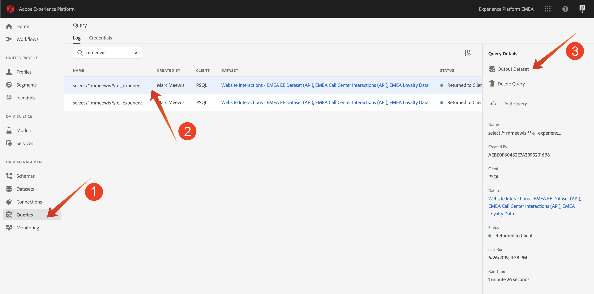
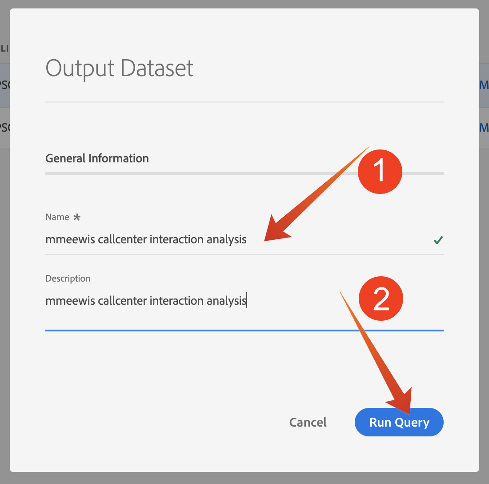
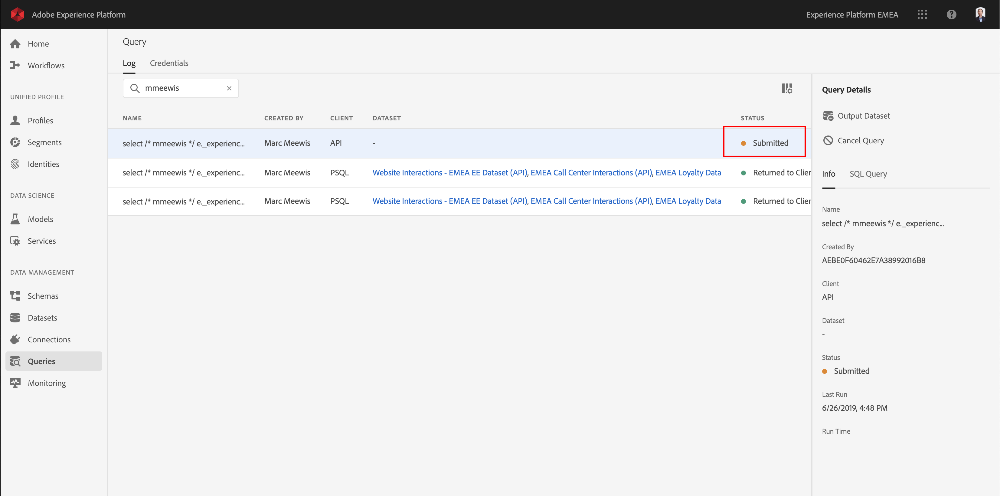
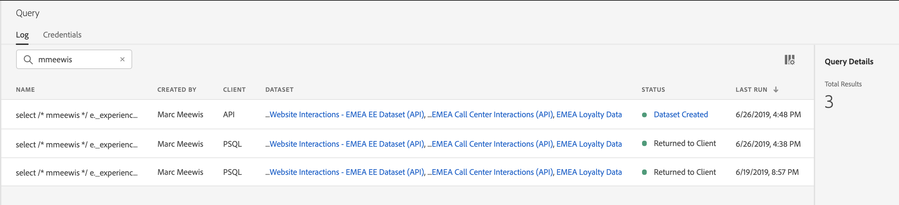
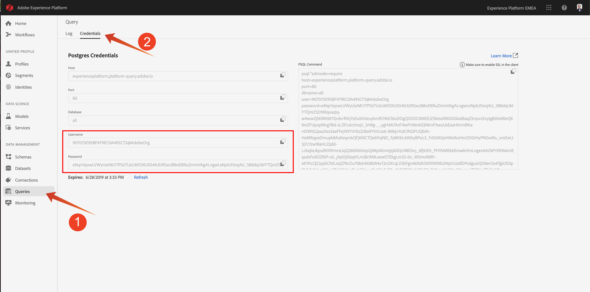
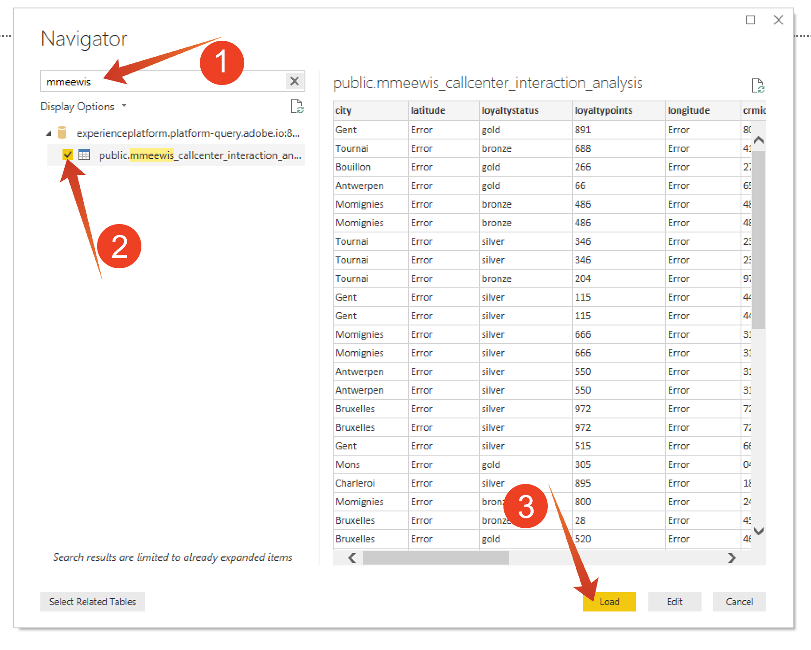

# Lesson 4 - Using the Query Service with Power BI

## Objective

Learn how to generate datasets from query results
Connect Microsoft Power BI Desktop directly to the Query Service
Creating a report in Microsoft Power BI Desktop

## Lesson Context

A command line interface to query data is exciting but it doesn't present well. In this lesson, we will guide you through a recommended workflow for how you can use Microsoft Power BI Desktop directly the Query Service to create visual reports for your stakeholders.

## Exercise 4.1 Create a dataset from a SQL query

The complexity of your query will impact how long it takes for the Query Service to return results. And when querying directly from the command line or other solutions like Microsoft Power BI the Query Service is configured with a 5 minute timeout (600 seconds). And in certain cases these solutions will be configured with shorter timeouts. To run larger queries and front load the time it takes to return results we offer a feature to generate a dataset from the query results. This feature utilizes the standard SQL feature know as Create Table As Select (CTAS). It is available in the Platform UI from the Query List and also available to be run directly from the command line with PSQL.

In the previous exercise you should have replaced "enter computer number" with you computer number before executing it in PSQL.

```sql
select /* enter computer number */
       e._platformlab05.identification.ecid as ecid,
       e.placeContext.geo.city as city,
       e.placeContext.geo._schema.latitude latitude,
       e.placeContext.geo._schema.longitude longitude,
       e.placeContext.geo.countryCode as countrycode,
       c._platformlab05.callDetails.callFeeling as callFeeling,
       c._platformlab05.callDetails.callTopic as callTopic,
       c._platformlab05.callDetails.contractCancelled as contractCancelled,
       l.loyaltystatus as loyaltystatus,
       l.loyaltypoints as loyaltypoints,
       l.crmid as crmid
from   bt_website_interactions e
      ,bt_call_center_interactions c
      ,bt_loyalty_data l
where  e.web.webPageDetails.URL like 'http://lab16.bt.com%'
and    e.web.webPageDetails.name in ('Cancel Service', 'Call Start')
and    e._platformlab05.identification.ecid = c._platformlab05.identification.ecid
and    l.ecid = e._platformlab05.identification.ecid;
```

Navigate to the Platform UI - https://platform.adobe.com
 

You will search for your executed statement in the Adobe Experience Platform Query UI by entering your computer number in the search field. I used '991' to identify my query:

Select "Queries" (1), enter your computer number in the search field (2), select your query (3)



and click "Output Dataset" (4).

Enter "bt your computer number callcenter interaction analysis" as name and description for the dataset and press the "Run Query" button



As a result, you will see a new query with a status "Submitted".



Upon completion, you will see a new entry for "Dataset Created" (you might need to refresh the page).



## Exercise 4.2 Explore the dataset with Power BI

Start Microsoft Power BI Desktop


Click "Get Data"


Search for "progres" (1), select "Progress" (2) from the list and "Connect" (3).


Enter platformlab02.platform-query.adobe.io:80 for the Server and "all" for the Database (1). Then click OK (2).


IMPORTANT Be sure to include port ':80' at the end of the Server value because the Query Service does not currently use the default PostgreSQL port of 5432

In the next dialog populate the User name and Password with your Username (ending in @AdobeOrg) and Password found in the "Connection Info" (2) section of the Queries menu (1).



In the Navigator dialog, put your station number in the search field (1) to locate your CTAS datasets and check the box next to each (2). Then click Load (3).



Make sure the "Report"-tab (1) is selected


Select the map (1) and after it is added to the reporting canvas, enlarge the map (2).


Next we need to define the measures and the dimensions, you do this by draging fields from the "fields" section onto the coresponding placeholders (located under "visualizations") as indicated below:


As measure we will use a count of "customerId". Drag the "crmid" field from the "fields" section into the "Size" placeholder":


Finally, to do some "callTopic" analysis, let's drag the "callTopic" field on to the "Page level filters" placeholder (you might have to scroll in the "visualizations" section);


When you select/deselect "callTopics" the number/size of circles on the map will change:


Congratulations! You have finished the Adobe Experience Platform Query Service Lab.
